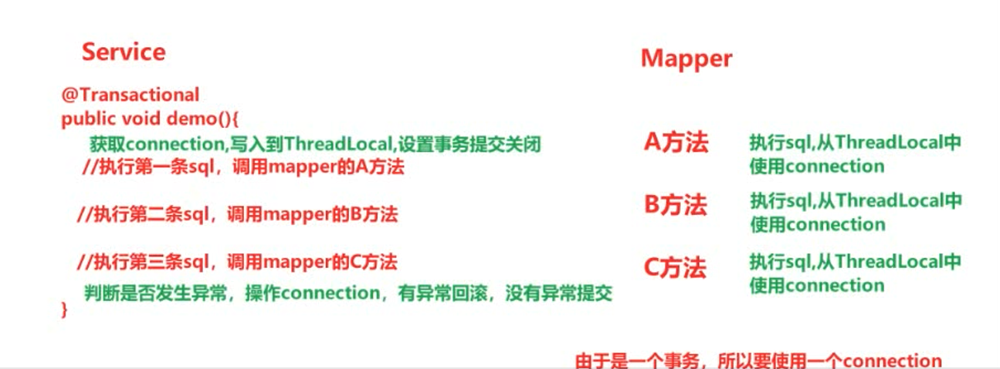
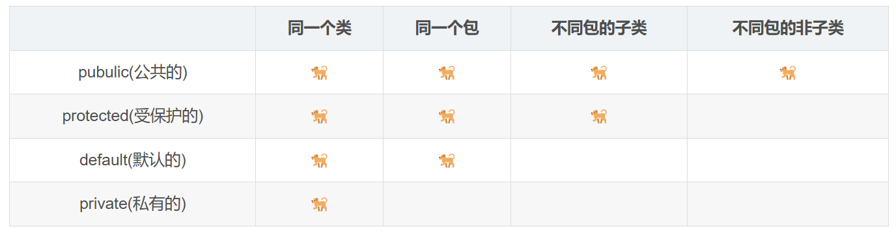

# Java


# 一、Java基础

## 1. Java基本数据类型

|        | 数据类型    | 字节数 | 位数 |
| ------ | ----------- | ------ | ---- |
| 整形   | byte        | 1      | 8    |
|        | short       | 2      | 16   |
|        | **int**     | 4      | 32   |
|        | long        | 8      | 64   |
| 浮点型 | float       | 4      | 32   |
|        | **double**  | 8      | 64   |
| 布尔型 | **boolean** | 1      | 8    |
| 字符型 | **char**    | 2      | 16   |


## 2. 方法重载与方法重写

>   **重载**：发生在同一个类中，方法名必须相同，参数列表不同，与返回值无关
>
>   **重写**：发生在父子类中，方法名、参数列表必须相同，返回值范围小于等于父类，抛出的异常范围小于等于父类，访问修饰符大于等于父类


## 3. ThreadLocal

>   *   ThreadLocal介绍
>
>       *   ThreadLocal是Thread的局部变量
>       *   ThreadLocal为每个线程提供单独一份存储空间
>       *   ThreadLocal存储的数据可以在一个线程内传递，不同线程是相互隔离的
>       *   底层是一个Map存储，每个ThreadLocal使用Entry存储数据，ThreadLocal对象本身作为key，数据作为value，值得注意的是**key是弱引用**
>
>   *   ThreadLocal应用场景
>
>       *   在一个线程内传递数据，例如传递登录数据
>
>       *   `@Transactional`注解，里面线程共享存储了数据库连接connection对线、事务传播行为等
>
>           *   回顾JDBC操作数据库的过程：
>
>               ```java
>               // 获取数据库连接对线：connection
>               connection.setAutoCommit(false); // 关闭自动提交事务
>               PrepareStatement pstmt = connection.preparedStatement(sql); // 获取数据库执行命令对象
>               pstmt.execute(); // 执行sql语句
>               // 释放资源：ResultSet、pstmt、connection
>               connection.commit(); // 没有异常则提交
>               connection.rollback(); // 有异常则回滚
>               ```
>
>           *   
>
>       *   注入HttpServletRequest对线和HttpServletResponse都使用的是ThreadLocal存取
>
>       *   使用mybatis框架时，pageHelper分页插件里面Page数据使用ThreadLocal存储
>
>   *   ThreadLocal的问题
>
>       *   当前线程使用完成后ThreadLocal存储的数据没有清理就放回线程池，后面再次取出继续使用的时候存储的数据就暴露了，这就是内存泄漏
>       *   解决方案：当前线程使用完成后要清理内存数据


## 4. 权限修饰符

>   1.   `public`：公开的，权限最大的修饰符，可以在任何一个类中任意使用
>   2.   `protected`：受保护的，不能修饰外部类，只能被同包下的其他类或子类访问
>   3.   `default`：默认的，即不写任何关键字，只能被同包下的其他类访问
>   4.   `private`：私有的，不能修饰外部类，不能被其他包访问
>
>   


## 5. 泛型的作用\<?\>和\<T\>的使用场景和区别

>   *   \<T\>：声明一个泛型类或者泛型方法，代表的是某一种具体的数据类型
>   *   \<?\>：使用泛型类或者泛型方法，代表的是泛指所有的对象类型


# 二、设计模式

## 1. 策略模式

>   策略模式是一种行为设计模式，它定义了一系列算法，并将每一种算法封装起来，使它们可以相互替换。策略模式让算法的变化独立于使用算法的客户。这种模式涉及到三个主要的角色：
>
>   1.   **策略接口**：定义一个公共接口，所有的算法或行为以这个接口为准。环境角色通过这个接口来调用具体的算法实现。
>   2.   **具体策略类**：实现了策略接口，封装了具体的算法或行为
>   3.   **环境类**：接受客户的请求，随后把请求委托给某一个策略类。环境类会维护对策略对象的引用，并可在运行时动态地改变具体的策略。这个类持有对策略对象的引用，并定义一个接口让策略对象可以访问它的数据。
>
>   **优点**：
>
>   *   算法自由转换：可以在运行时切换对象内部的算法，改变对象的行为
>   *   简化单元测试：每个算法都有自己的类，可以通过自己的接口单独测试
>   *   符合开闭原则：对扩展开放，对修改关闭，增加新的算法时不需要修改环境类代码
>
>   **缺点**：
>
>   *   客户端必须知道所有的策略类，并自行决定使用哪一个策略类
>   *   策略模式会造成有很多的策略类，增加了对象的数目

*实际案例*：目前有很多的业务都具有支付功能，在支付功能中可能会有多种支付的方式，遇到这一类情况的业务时我们就可以采取策略模式。[附代码](./code/src/main/java/com/zhuzi/ce_lue)

*   普通写法

```java
@RestController
@RequestMapping("/celue")
public class PaymentController {

    @Autowired
    private PayService payService;

    /**
     * 普通流程支付
     *
     * @param payType 支付方式
     * @return
     */
    @GetMapping("/pay1")
    public Boolean pay1(@RequestParam String payType) {
        return payService.pay(payType);
    }

}
```

```java
// service.impl类
@Service
public class PayServiceImpl implements PayService {

    // 支付方法
    @Override
    public Boolean pay(String payType) {
        if ("1".equals(payType)) {
            // 微信支付
            return weiXinPay();
        } else if ("2".equals(payType)) {
            // 支付宝支付
            return aliPay();
        }
        return false;
    }

    // 微信支付
    private Boolean weiXinPay() {
        return false;
    }

    // 支付宝支付
    private Boolean aliPay() {
        return false;
    }

}
```

如果我们这时需要增加一个新的支付方式（例如“银联支付”），那么只能在service中修改业务代码，增加一层`else if`，并在下方新增一个银联支付的代码。

*   策略模式

```java
// 策略接口
public interface PayServiceStrategy {

    // 支付策略
    Boolean pay();

}
```

```java
// 具体策略类
public class UnionPayServiceImpl implements PayServiceStrategy {
    @Override
    public Boolean pay() {
        System.out.println("银联支付");
        return false;
    }
}
```

```java
// 定义枚举类
@Getter
public enum PayStrategyEnum {
    // 微信支付
    WEI_XIN_PAY("1", SpringUtils.getBeanByClass(WeixinPayServiceImpl.class)),
    // 支付宝支付
    ALI_PAY("2", SpringUtils.getBeanByClass(AliPayServiceImpl.class)),
    // 银联支付
    UNION_PAY("3", SpringUtils.getBeanByClass(UnionPayServiceImpl.class));

    private String payType;
    private PayServiceStrategy payServiceStrategy;

    PayStrategyEnum(String payType, PayServiceStrategy payServiceStrategy) {
        this.payType = payType;
        this.payServiceStrategy = payServiceStrategy;
    }

    public static PayServiceStrategy getByPayType(String payType) {
        if (StringUtils.isBlank(payType)) {
            return null;
        }
        for (PayStrategyEnum payStrategyEnum : PayStrategyEnum.values()) {
            if (payStrategyEnum.payType.equals(payType)) {
                return payStrategyEnum.getPayServiceStrategy();
            }
        }
        return null;
    }
}
```

```java
// controller层
@RestController
@RequestMapping("/celue")
public class PaymentController {

    @Autowired
    private PayService payService;

    /**
     * 策略模式支付
     *
     * @param payType 支付方式
     * @return
     */
    @GetMapping("/pay2")
    public Boolean pay2(@RequestParam String payType) {
        // 1. 根据payType选择一个Bean对象执行
        PayServiceStrategy payServiceStrategy = PayStrategyEnum.getByPayType(payType);
        if (Objects.isNull(payServiceStrategy)) {
            return false;
        }
        // 2. 调用不同的策略支付
        return payServiceStrategy.pay();
    }

}
```

此时如果需要添加新的支付方式，只需新增新的策略类实现策略接口，并在枚举类中“注册”即可。


## 2. 建造者模式


## 3. 观察者模式


## 4. 责任链模式

