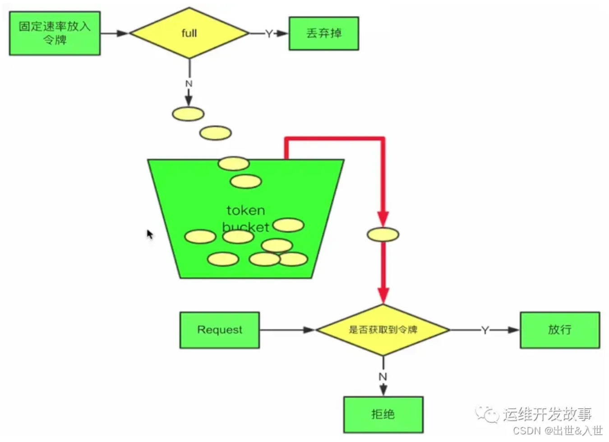
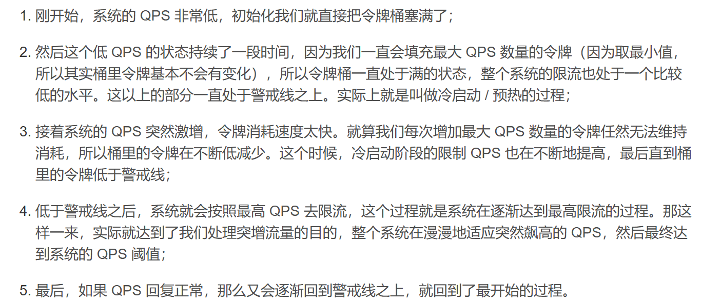
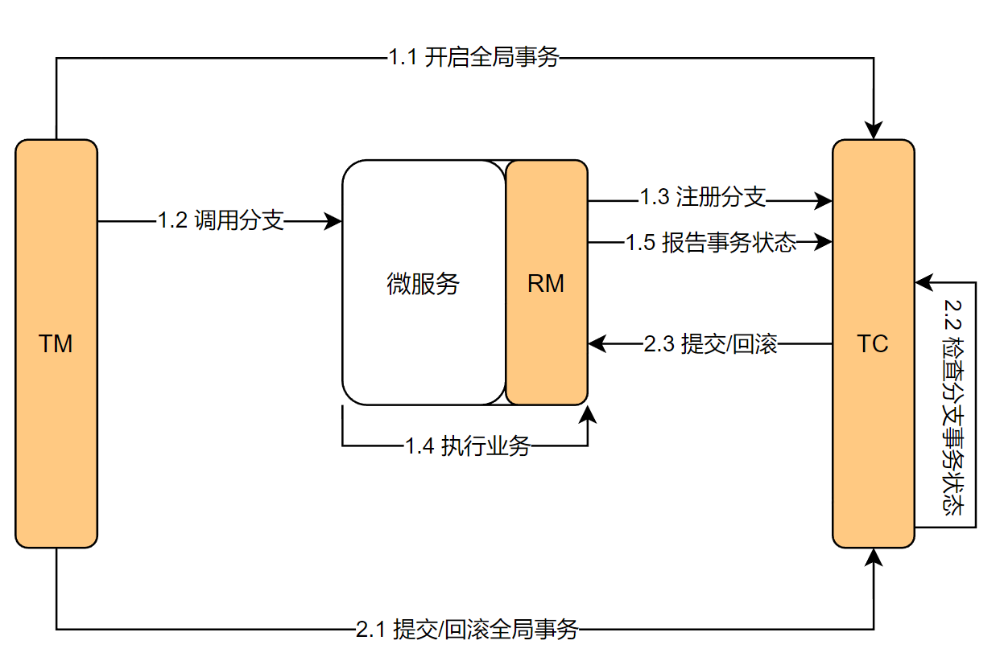
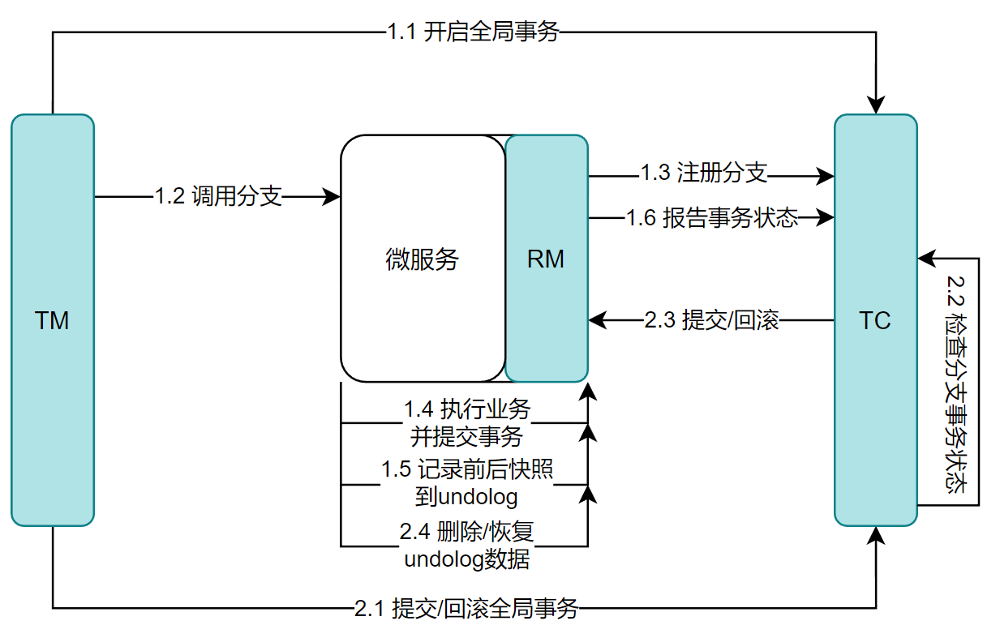
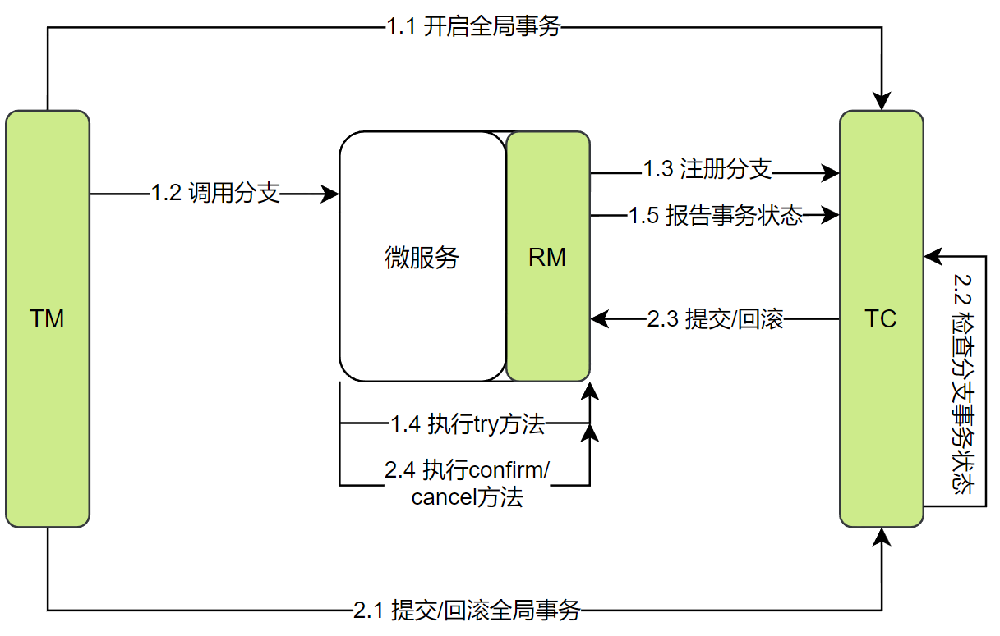

# 微服务

# 一、分布式与微服务

## 1. 微服务架构的演变历程

>   *   单体架构：所有业务代码全部堆积在同一个项目中，打包部署在一台服务器上，架构简单，部署成本低，但是耦合度较高。
>   *   分布式架构：随着业务量的增多，单体架构已经不足以支持业务的运转，这时候就引入了分布式架构。我们可以按业务的维度对系统进行拆分，每个业务功能模块作为独立项目开发，可以独立运行的模块称为一个服务。它的优点就是解耦，有利于服务的升级和拓展，缺点就是编码复杂，部署成本高。
>   *   微服务架构：对于分布式架构虽然降低了耦合度，但是也有一些问题需要考虑：服务的拆分粒度如何？如何维护服务集群？如何实现服务之间的调用？如何感知各个服务的状态？对于这些问题，微服务架构有比较好的解决方案。微服务架构的特点是：
>       *   职责单一：微服务的拆分粒度更小，每一个服务都对应一个唯一的业务
>       *   面向服务：微服务对外暴露业务接口
>       *   自治：团队独立、技术独立、数据独立、部署独立
>           *   团队独立：一个服务可以一个人负责，也可以一个团队负责
>           *   技术独立：每个服务与语言技术无关
>           *   数据独立：每个服务都有自己的数据库
>           *   部署独立：每个服务可以单独打包部署，不会影响其它服务
>       *   隔离性强：服务调用做好隔离、容错、降级，避免出现级联问题

# 二、SpringCloud

## 1. SpringCloud的五大组件

>   以国内外非常火热的SpringCloud和SpringCloudAlibaba为例
>
>   *   注册中心
>       *   SpringCloud使用Eureka作为注册中心
>       *   SpringCloudAlibaba使用Nacos作为注册中心
>   *   配置中心
>       *   SpringCloud使用SpringCloudConfig作为配置中心
>       *   SpringCloudAlibaba使用Nacos作为配置中心
>   *   负载均衡
>       *   使用Ribbon进行负载均衡
>       *   我们使用Feign进行远程调用，它的底层已经自动集成了Ribbon
>   *   服务网关
>       *   官方推荐使用Gateway
>       *   Zuul使用的是阻塞式的API，性能不好
>   *   服务监控和保护
>       *   SpringCloud使用Hystrix进行服务熔断
>       *   SpringCloudAlibaba使用Sentinel作为服务保护

## 2. nacos服务注册与发现原理

>   在服务调用关系中，会有两个不同的角色，一个是服务提供者，一个是服务消费者。
>
>   服务提供者会在启动时将它的服务名和url注册到nacos中，并且会每隔一段时间会向注册中心发送心跳续约
>
>   nacos注册中心会存储提供者的服务名和url，并提供给消费者使用。此外它还会定期检测服务提供者的心跳续约和定期推送服务名和url供消费者使用
>
>   服务消费者默认在第一次调用服务时会向nacos注册中心拉取服务，我们也可以开启懒加载在启动时就进行拉取。然后它会根据可用的服务进行负载均衡和远程调用提供者

## 3. eureka和nacos的区别

>   1.   nacos会主动检测服务提供者的状态，临时实例采用心跳续约，永久实例采用主动检测方式
>   2.   临时实例心跳不正常会被剔除，永久实例则不会被剔除
>   3.   当服务列表发生变更时，nacos支持主动推送给消费者
>   4.   eureka是短链接操作，nacos是基于netty实现的长连接
>   5.   集群环境中（cap定理），Eureka采用的是ap模式，而nacos默认是ap，也可用采用cp模式

## 4. Ribbon的负载均衡策略

>   *   ZoneAvoidanceRule  区域规避规则：是默认的负载均衡策略。以区域可用的服务器为基础进行服务器的选择。假设北京、上海、广州都有机房，在微服务之间调用的时候，当微服务A调用微服务B，如果微服务B在北上广的机房中都存在，那么这个策略会首先获得所有可用的机房，然后随机出一个机房，机房中有多台服务器进行轮询调用
>   *   RoundRobinRule  简单轮询服务列表来选择服务器
>   *   WeightedResponseTimeRule  加权响应时间策略，响应时间越短越容易被选上
>   *   AvailabilityFilteringRule  可用性敏感策略，过滤掉性能差的服务
>   *   RandomRule  随机选择一个可用的服务器
>   *   BestAvailableRule  选择并发数较低的可用服务器
>   *   RetryRule  重试策略，在规定的时间范围内不停的选择服务，直到选到可用的服务

## 5. 如何修改负载均衡策略

>   *   代码方式：定义新的IRule。在服务消费者中通过`@Bean`注解标识一个方法，方法中返回新的规则对象，用IRule接收
>   *   配置文件方式：在服务消费者的配置文件中直接给某个微服务配置负载均衡规则即可

## 6. 项目中如何使用springcloud的gateway

>   *   gateway网关是整个微服务的入口，在整个项目中起到拦截、路由、限流的作用。
>   *   在项目中网关接收到请求后，先进行断言，过滤器的执行流程是默认过滤器、路由过滤器、全局过滤器，我们项目中用到了全局过滤器，通过实现GlobalFilter接口重写方法实现。
>   *   在全局过滤器中，我们可以用来做权限校验，从请求头中获取token，然后解析token。如果可以进行正常解析，此时进行放行，如果解析不到直接返回。

## 7. 项目中如何管理配置文件

>   *   大部分的固定的配置文件都放在服务本地 , 一些根据环境不同可能会变化的部分, 放到Nacos中
>   *   我们可以使用“服务名-环境名.后缀名”来配置指定环境的配置文件，可以使用“服务名.后缀名”来配置所有环境的共享配置文件，各个文件的优先级最高的是指定环境的配置文件，然后是共享配置文件，最后是本地的配置文件

## 8. sentinel的过滤算法

>   1.   滑动窗口算法
>
>        滑动窗口算法是将时间周期分为N个小周期（窗口），分别记录每个小周期内访问次数，然后根据时间将窗口往前滑动并删除过期的小时间窗口。最终只需要统计滑动窗口范围内的所有小时间窗口总的技术即可。
>
>   2.   令牌桶算法
>
>        
>
>        
>
>   3.   漏桶算法
>
>        漏桶算法是将访问请求放入漏桶中，当请求达到限流值，则进行触发限流策略。无论有多少请求，请求的速率有多大，都按照固定的速率流出，对应到系统中就是按照固定的速率处理请求。超过漏桶容量的直接抛弃。
>
>        这种方式主要用于处理间歇性突发的流量，例如在某一时刻有大量的请求到来，而接下来的几秒则处于空闲状态，我们希望系统能够在接下来的空闲期间逐渐处理这些请求，而不是在第一秒直接拒绝多余的请求。

# 三、分布式事务（seata）

## 1. CAP定理

>   CAP定理：在一个分布式系统中，一致性(**C**onsistency)、可用性(**A**vailability)、分区容错性(**P**artition tolerance)，这三个要素最多只能同时实现两点，不可能三者兼容。
>
>   *   一致性(Consistency)：所有节点在同一时间具有相同的数据
>   *   可用性(Availability)：保证每个请求不管成功或者失败都有响应
>   *   分区容错性(Partition tolerance)：系统中任意信息的丢失或失败不会影响系统的继续运作
>
>   一般来说，现实中分区容错是无法避免的，因此可用认为CAP的P总是成立，在分布式系统中，CAP定理就只能在A和C之间做取舍，允许网络之间出现通讯故障，即在CP和AP二选一。
>
>   *   CP：当网络出现故障时，只能保证数据一致性，用户访问时会出现持续等待的现象，得不到响应，直到网络恢复且数据成功同步后，用户才能得到响应
>   *   AP：当网络出现故障时，不能保证数据一致性，只能保证可用性，用户访问时有可能获取最新的数据，也有可能获取的是脏数据

## 2. BASE理论

>   BASE是Basically Available(基本可用)、Soft state(软状态)、Eventually consistent(最终一致性)三个短语的缩写。BASE理论是对CAP中一致性和可用性权衡的结果：**即使无法做到强一致性，但每个应用都可用根据自身业务特点，采用适当的方式来使系统达到最终一致性**。用白话说，就是在AP的同时，我想要一点C，或者在CP的同时，我想要一点A。

## 3. seata的四种模式

>   **三个角色：**
>
>   *   TC(Transaction Coordinator)事务协调者：维护全局和分支事务的状态，协调全局事务提交或回滚
>   *   TM(Transaction Manager)事务管理者：定义全局事务的范围、开始全局事务、提交或回滚全局事务
>   *   RM(Resource Manager)资源管理者：管理分支事务处理的资源，与TC交谈以注册分支事务和报告分支事务的状态，并驱动分支事务提交或回滚
>
>   seata提供了四种分布式事务的解决方案：
>
>   *   **XA**模式：强一致性分阶段事务，牺牲了一定的可用性，无业务侵入
>
>       
>
>   *   **AT**模式：最终一致的分阶段事务，无业务侵入，也是seata的默认模式
>
>       
>
>   *   **TCC**模式：最终一致的分阶段事务，有业务侵入
>
>       
>
>   *   **SAGA**模式：长事务模式，有业务侵入
>
>       saga也分两个阶段，一阶段直接提交本地事务，二阶段成功则什么都不做，失败则通过编写补偿业务来回滚。

