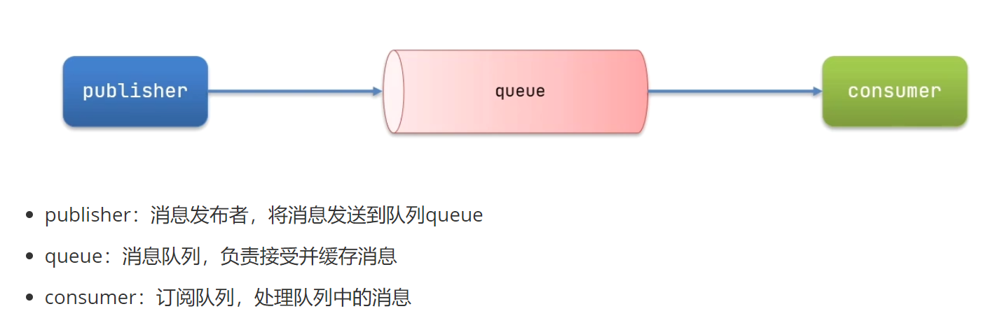
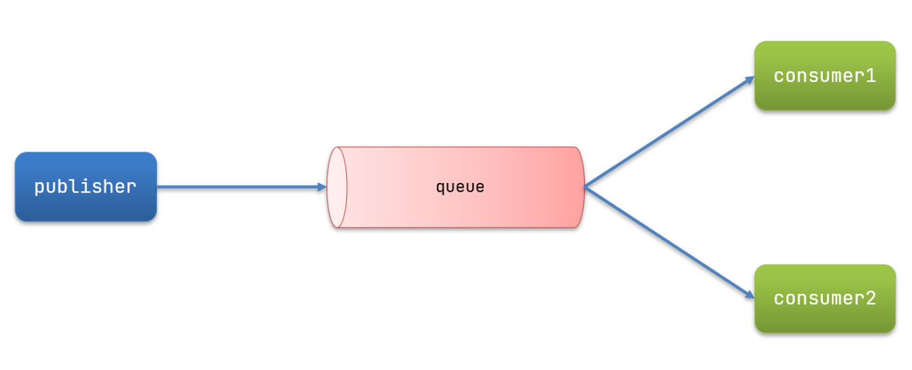
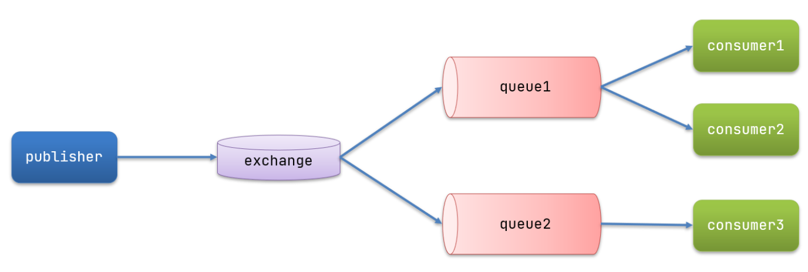

# 消息队列面试题

# 一、RabbitMQ

## 1. 为什么要使用MQ

>   项目中使用消息队列能够实现系统之间的异步通信和消息持久化，在降低耦合的同时能够使系统的吞吐量提升，并且能够故障隔离和流量削峰

## 2. RabbitMQ应用场景

>   MQ在实际生产中有很多的应用场景，基本上我们进行增删改的操作都可以通过消息队列进行异步通信处理，保证最终一致性即可。或者说对实时性要求不高的场景都可以使用消息队列。

## 3. RabbitMQ如何保障消息可靠生产

>   消息从发送到消费者接收会经历多个过程，其中每一步都可能导致消息丢失，RabbitMQ对一些丢失情况给出了解决方案：
>
>   *   对于消息从生产方发送到交换机丢失的情况提供了**发布者确认机制publisher-confirm**，消息如果发送失败交换机会向生产者返回NAK，生产者通过回调接收发送结果，如果发送失败，重新发送，或者记录日志人工介入。发送成功则发送ACK。
>   *   对于消息从交换机发送到队列丢失的情况提供了**发布者回执机制publisher-return**，消息从交换机路由到队列失败则会向生产者返回失败原因和ACK，生产者通过回调接收发送结果，如果发送失败，重新发送，或者记录日志人工介入。发送成功则不返回。
>   *   对于消息在队列中丢失的情况提供了**MQ持久化机制**，我们需要手动开启队列持久化才能实现消息持久化。
>
>   而对于一些例如回调丢失的例外情况，我们就需要通过程序来控制消息生产的可靠。我们可以设计一个消息状态表，包含消息的id、消息的内容、签收的状态等信息，发送方每发送一条消息都会向消息状态表中存入，并将状态设置为未签收，当消费者消费完毕后会返回一条签收消息，发送方接收到签收消息后会将状态改为已签收。此外还会开启定时任务对状态表中的未签收消息进行重新发送，对已签收的消息进行清理。

## 4. RabbitMQ如何保障消息可靠消费

>   保证消费者的消费可靠主要考虑两个方面，一个是在消费者处消费失败消息，这个可以通过上题的确认机制，使生产者重新发送消息。SpringAMQP允许配置三种确认模式：
>
>   *   manual：手动ACK，需要在业务代码结束后调用API发送ACK
>   *   auto：自动ACK，由spring检测代码是否出现异常，没有异常则返回ACK，抛出异常则返回NAK
>   *   none：关闭ACK，RabbitMQ假定消费者获取消息后会成功处理，因此消息投递后立即被删除
>
>   此外，我们可以开启消费者失败重试机制，设置MessageRecoverer，多次重试后将消息投递到异常交换机，交由人工处理。
>
>   另一个就是消息重复消费问题，这个我们可以通过给每条消息设置一个唯一的标识id解决。这其实就是一个幂等性的校验方案，我们可以在消费者消费后将这个唯一id存入redis中，每次消费前检验redis是否有这个id，如果有则不消费，没有则消费信息。此外可以设置定时任务对redis的id进行清除。这个方案有很多，用mysql的锁也可以实现。

## 5. RabbitMQ消息失败重试机制

>   *   RejectAndDontRequeueRecoverer：重试耗尽后，直接reject，丢弃消息，默认就是这种方式
>   *   ImmediateRequeueMessageRecoverer：重试耗尽后，返回nak，消息重新入队
>   *   RepublishMessageRecoverer：重试耗尽后，将失败消息投递到指定的交换机

## 6. RabbitMQ的死信队列与死信交换机

>    当一个队列中的消息满足下列情况之一时，可以成为死信（dead letter）：
>
>   *   消费者使用basic.NAK或basic.reject声明消费失败，并且消息的requeue参数被设置为false
>   *   消息在队列的存活时间超过设置的TTL时间
>   *   消息队列的消息数量已经超过最大队列长度，最早的消息可能成为死信
>
>   “死信”消息会被RabbitMQ进行特殊处理，如果这个包含死信的队列配置了`dead-letter-exchange`属性，指定了一个交换机，那么队列中的死信就可以投递到这个交换机中，而这个交换机称为死信交换机。此外，队列将死信投递给死信交换机时，必须获取死信交换机的名字和死信交换机与死信队列绑定的路由key才能正确路由到指定的死信队列。

## 7. RabbitMQ如何解决消息积压问题

>   消息过多，消费者消费速度太慢：
>
>   *   设置多个消费者并发消费，就是类似于工作队列模式
>
>   *   设置消息的存活时间(TTL)
>   *   扩大队列容积，提高堆积上限，可以考虑使用惰性队列
>

## 8. 分布式系统中数据同步问题

>   *   最常用的手段就是使用MQ
>   *   使用canal不断监听数据库数据变更，发现变更就进行数据同步，缺点是成本高
>   *   在修改数据之后，通过远程调用其它服务接口来同步数据，缺点是性能差

## 9. RabbitMQ消息类型有哪些？

>   *   普通消息：正常生产正常消费的消息，包含同步消息、异步消息、单向消息
>   *   顺序消息：消息会严格按照消息的发送顺序进行消费。需要保证只有一个消费者非并发地消费消息
>   *   广播消息：类似于广播消息模型
>   *   延时消息：当消息写入到Broker后，在指定的时长后才会被消费。可以设置消息的TTL，使消息成为死信后路由到死信队列，启用服务监听这个队列即可
>   *   批量消息：生产者在生产消息时可以一次性发送多条消息，消费者在消费时也可以同时获取多条数据进行消费
>   *   事务消息：在分布式系统中的一个事务场景内，一个事务消息被消费失败了，需要保证其它服务不会消费他们队列中的事务消息。可以通过AMQP的事务机制实现，也能使用发送者确认模式实现

## 10. RabbitMQ的消息模型

>   RabbitMQ主要有三个常用的模型，分别是基本消息队列、工作消息队列、发布订阅模型。
>
>   *   基本消息队列：
>
>       
>
>   *   工作消息队列：
>
>       
>
>   *   发布订阅：又根据交换机类型不同分为三种：广播、路由、主题
>
>       
>
>       *   广播队列：将消息交给所有绑定到交换机的队列
>       *   路由队列：将消息交给符合指定路由key的队列
>       *   主题队列：将消息交给匹配路由key的队列，支持通配符