# JVM


# 1. 内存结构

1.   JVM的好处

>   1.   一次编写，到处运行
>   2.   自动内存管理，垃圾回收功能
>   3.   数组下标越界检查
>   4.   jvm内部使用了虚方法表机制实现多态


2.   JVM、JRE、JDK

>   JVM：Java Virtual Mechinal，Java虚拟机，用于执行编译后的Java文件，也就是class字节码文件，也是Java实现跨平台的核心。JVM是面向系统的，不是面向硬件的。
>
>   JRE：Java Runtime Environment，Java运行环境，用于运行Java程序，由JVM和核心内库组成。
>
>   JDK：Java Development kit，Java开发工具包，用于程序员开发，由JRE和开发工具组成。
>
>   程序运行只需要JRE，程序员开发需要JDK。


3.   JVM组成

>   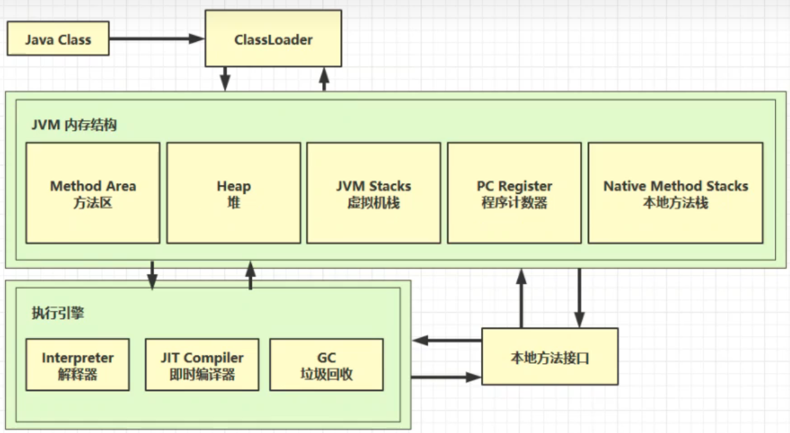
>
>   Java源代码被编译成.class**字节码文件**后，通过**类加载器**加载到JVM内存中，类放在**方法区**部分，类创建的实例放在**堆**中，堆里的实例调用方法时又会用到**虚拟机栈**、**程序计数器**、**本地方法栈**，方法执行时的每行代码是由执行引擎中的**解释器**逐行执行的，方法中的热点代码(频繁调用的代码)会被**即时编译器**优化执行，执行引擎中的GC模块会对堆中不再被引用的实例进行**垃圾回收**。最后还有一些Java不方便实现的功能，需要调用底层操作系统，这时就需要用到**本地方法接口**。


4.   JVM内存结构

>   *   方法区：是Java虚拟机线程共享的区域，存储着类结构相关的信息，包括类的成员变量、方法数据、成员方法与构造器方法的代码、代码块
>   *   堆：类创建的实例存放在堆中
>   *   程序计数器：记住下一条JVM指令的执行地址
>   *   虚拟机栈：线程运行需要的内存空间
>   *   本地方法栈：给本地方法的运行提供一个空间


5.   程序计数器

>   *   作用：记住下一条JVM指令的执行地址
>   *   特点：
>       *   是线程私有的
>       *   不存在内存溢出


6.   Java虚拟机栈

>   *   每个线程运行时所需要的内存称为虚拟机栈
>   *   每个栈由多个栈帧组成，对应着每次方法调用时所占用的内存
>   *   每个线程只能有一个活动栈帧，对应着当前正在执行的那个方法
>
>   问题辨析：
>
>   *   垃圾回收是否涉及栈内存？
>       *   不涉及，栈帧用完就会释放
>   *   栈内存分配越大越好吗？
>       *   不是，栈内存设置得越大，最大线程数会越少
>   *   方法内从局部变量是否线程安全？
>       *   如果方法内局部变量没有逃离方法的作用访问，它就是线程安全的


7.   本地方法栈

>   *   作用：Java虚拟机调用一些本地方法时需要给本地方法提供的一个内存空间
>       *   本地方法：不是由Java代码编写的方法，如果我们想直接使用操作系统的API，则需要使用C或C++代码与操作系统底层的API打交道
>       *   Java代码可以通过本地方法间接地调用操作系统API


8.   堆

>   *   通过new关键字创建的对象都会使用堆内存
>   *   它是线程共享的，堆中对象都需要考虑线程安全问题
>   *   有垃圾回收机制


9.   方法区

>   *   作用：是Java虚拟机线程共享的区域，存储着类结构相关的信息，包括类的成员变量、方法数据、成员方法与构造器方法的代码、代码块
>   *   特点：
>       *   在虚拟机启动时创建
>       *   官方说明中，在逻辑上其实是堆的一部分，但实际上不同的JVM厂商有不同的实现
>       *   JDK8以前方法区位于永久代中，使用的是堆内存的一部分作为永久代，从JDK8开始永久代被移除，方法区存在于元空间中，元空间使用的是本地内存，即操作系统的内存
>       *   方法区如果内存溢出也会抛出OOM


10.   直接内存(Direct Memory)

>   *   直接内存并不属于Java虚拟机的内存，而是属于操作系统的内存
>   *   常见于NIO操作时，用于数据缓冲区
>   *   分配回收成本较高，但读写性能高
>   *   不受JVM内存回收管理
>   *   GC不会清理直接内存，直接内存的释放必须手动调用unsafe的freeMemory方法来释放直接内存
>
>   使用普通IO读取文件：
>
>   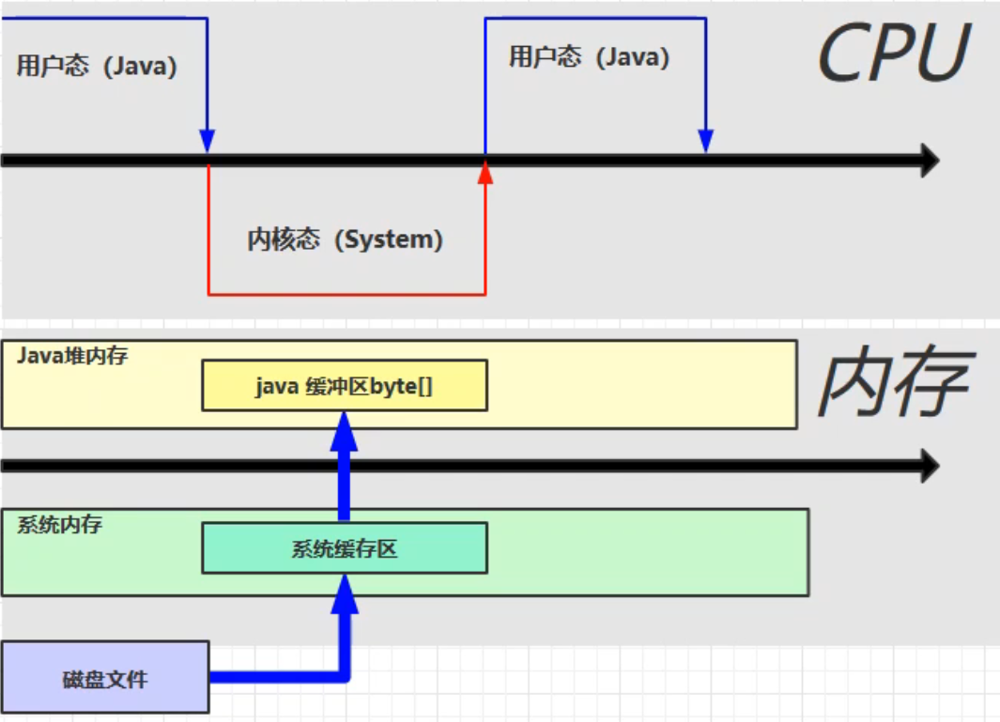
>
>   使用直接内存会减少一次数据的拷贝：
>
>   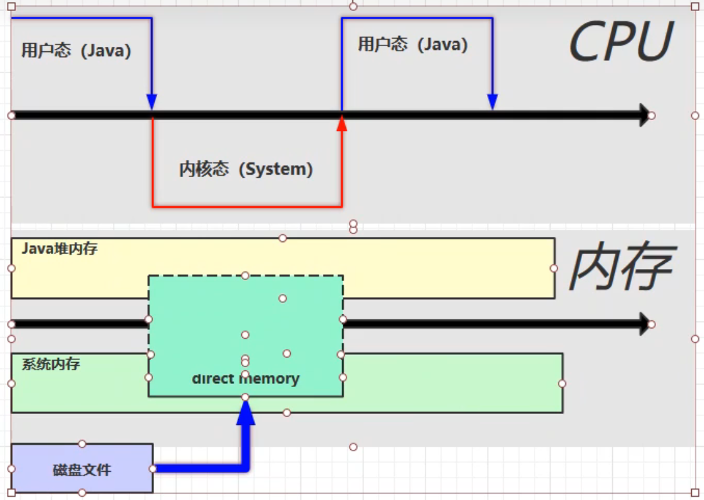


# 2. 垃圾回收

1.   如何判断对象可以回收

>   1.   引用计数法
>
>        *   对象被引用则计数加一，如果引用计数为0则对象被回收
>
>        *   无法处理循环引用问题
>
>            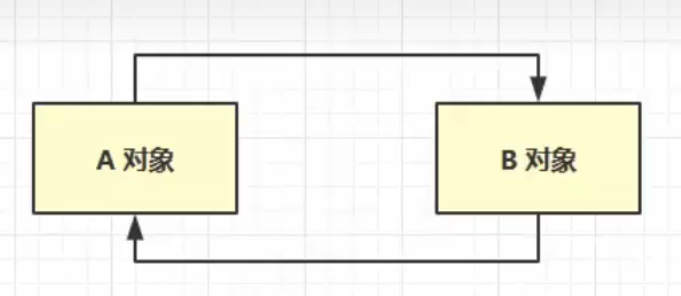
>
>   2.   可达性分析算法
>
>        *   首先确定根对象，再扫描全部的对象，如果这个对象直接或间接地被根对象引用，则不能被垃圾回收，否则可以被垃圾回收
>            *   根对象可以理解为肯定不能被垃圾回收的对象
>            *   以葡萄举例，提起一串葡萄，只有与葡萄的根直接或间接连接的对象才能被提起，否则会落在盘子里被吃掉
>
>   *   Java虚拟机中的垃圾回收器采用可达性分析算法来探索所有存活的对象
>
>   *   扫描堆中的对象，看是否能够沿着GC Root对象为起点的引用链找到该对象，找不到则表示可以回收
>
>   *   哪些对象可以作为GC Root？
>
>       *   JVM虚拟机中运行的核心类对象
>       *   操作系统运行时引用的Java对象，即本地方法栈中的引用的对象
>       *   正在加锁的对象
>
>       *   虚拟机栈中的局部变量表引用的对象，方法区中类静态属性引用和常量引用对象


2.   五种引用与垃圾回收

>   1.   强引用：只有所有GC Root对象都不通过强引用引用该对象，该对象才能被垃圾回收
>
>   2.   软引用：发生垃圾回收时如果内存不够则会被回收，可以配合引用队列使用
>
>   3.   弱引用：发生垃圾回收时会被回收，可以配合引用队列使用
>
>   4.   [虚引用](https://www.bilibili.com/video/BV1yE411Z7AP/?p=53&share_source=copy_web&vd_source=89afe35cfd861b2988f5d91f09982fa5&t=38)：必须配合引用队列使用
>
>        以ByteBuffer为例，现有一虚引用和GC Root指向ByteBuffer，创建ByteBuffer时就会创建一个Cleaner虚引用对象，当GC Root不再指向ByteBuffer时，ByteBuffer会被GC回收，但由于直接内存无法被GC回收，所以在虚引用中会保存一个直接内存的地址，当ByteBuffer被回收后虚引用就会进入到引用队列中，这个引用队列会有一个叫做Reference Handler的线程去定时扫描有没有新入队的Cleaner，有则会调用Cleaner的clean方法，该方法会调用Unsafe的freeMemory释放虚引用中指向的直接内存
>
>   5.   终结器引用：必须配合引用队列使用
>
>        所有对象都会直接或间接继承Object类，Object类中存在一个finallize方法，这个方法就是终结方法。当我们重写终结方法，并且没有被强引用引用时，则会被当成垃圾回收。这个终结方法什么时候被调用呢？我们重写这个方法就是希望该对象被垃圾回收时能够调用这个方法，这时就需要终结器引用。当没有GC Root指向重写了终结方法的对象时，就会创建一个终结器引用并加入到引用队列，再由一个优先级很低的Finallize Handler线程会在某些时机查看是否有新的终结器引用入队，如果有则调用该引用所指向对象的finallize方法，并在下一次垃圾回收时对该对象进行回收


3.   垃圾回收算法

>   *   标记清除算法
>
>       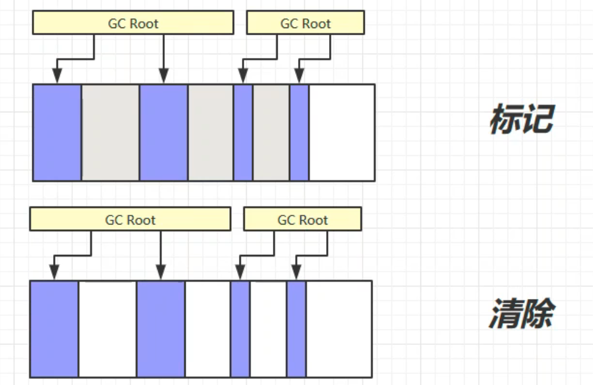
>
>       *   一阶段标记，二阶段清除
>       *   优点：速度快
>       *   缺点：容易产生内存碎片
>
>   *   标记整理算法
>
>       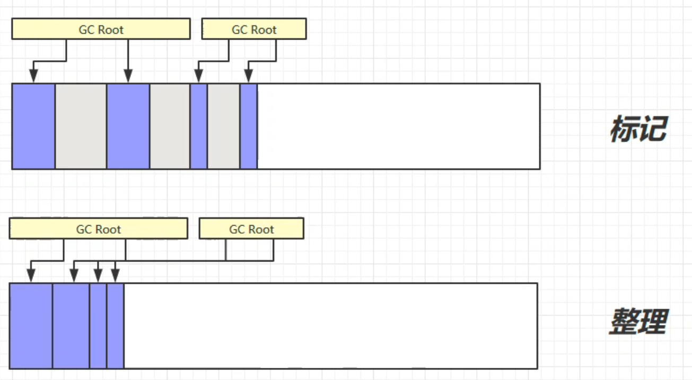
>
>       *   一阶段标记，二阶段整理，在整理时会移动未被清除的数据，使内存更紧凑
>       *   优点：没有内存碎片
>       *   缺点：速度慢
>
>   *   复制算法
>
>       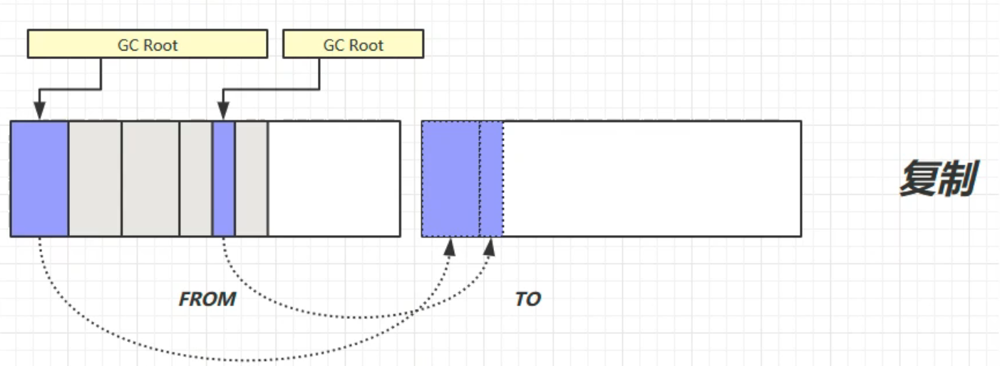
>
>       *   复制算法是把内存区划分成大小相等的两块区域，待回收的区域称为FROM区域，已回收的区域称为TO区域，TO区一般情况下是空闲着的。进行垃圾回收时会将所有需要保留的对象复制到TO区，在复制的过程中就会完成碎片的整理，然后将FROM区中的对象删除，再交换FROM与TO区的地址。
>       *   优点：没有内存碎片
>       *   缺点：占用双倍内存空间
>
>   
>
>   这三种算法JVM会根据不同的情况使用，不是说只选择其中的一种或两种，而是结合多种算法共同实现垃圾回收。


4.   分代垃圾回收

>   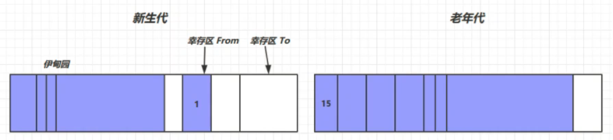
>
>   *   对象首先分配在伊甸园区域
>   *   新生代空间不足时，触发minor gc，伊甸园和from区域存活的对象使用复制算法复制到to区域中，存活的对象年龄加1并且交换from区域与to区域
>   *   minor gc会引发stop the world，暂停其它用户的线程，等垃圾回收介绍，用户线程才恢复运行
>   *   当对象寿命超过阈值时，会晋升至老年代，最大寿命是15(4bit)，不同垃圾回收器可能会有不同
>   *   当老年代空间不足时，会先尝试触发major gc，如果之后空间仍然不足，那么触发full gc，STW的时间会更长


5.   垃圾回收器

>   1.   [串行](https://www.bilibili.com/video/BV1yE411Z7AP/?p=69&share_source=copy_web&vd_source=89afe35cfd861b2988f5d91f09982fa5)
>
>        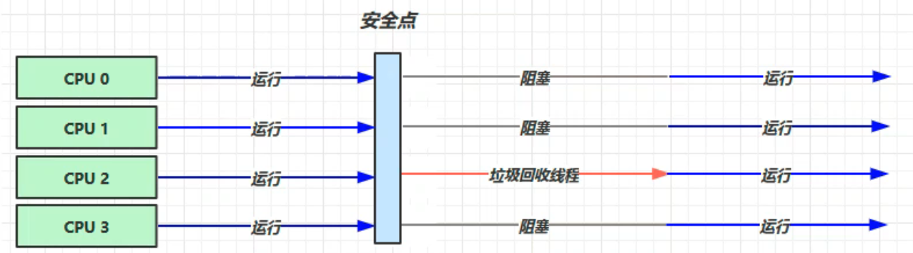
>
>        *   JVM参数：-XX:+UseSerialGC=Serial+SerialOld
>        *   垃圾回收采用标记整理算法
>        *   单线程
>        *   堆内存较小，适合个人电脑
>
>   2.   [吞吐量优先](https://www.bilibili.com/video/BV1yE411Z7AP/?p=70&share_source=copy_web&vd_source=89afe35cfd861b2988f5d91f09982fa5)
>
>        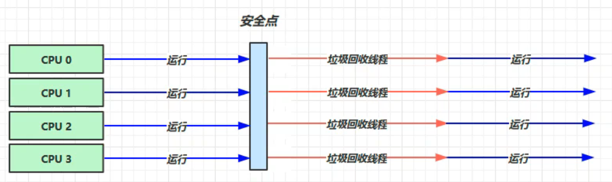
>
>        *   JVM参数：-XX:+UseParallelGC ~ -XX:+UseParallelOldGC
>        *   JDK1.8默认开启，且只需开启一个，另一个默认开启
>        *   垃圾回收采用标记整理算法
>        *   多线程
>        *   堆内存较大，多核CPU
>        *   让单位时间内，STW的时间最短
>
>   3.   [响应时间优先](https://www.bilibili.com/video/BV1yE411Z7AP/?p=71&share_source=copy_web&vd_source=89afe35cfd861b2988f5d91f09982fa5)
>
>        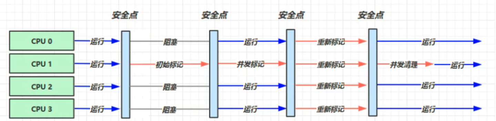
>
>        *   JVM参数：-XX:+UseConcMarkSweepGC ~ -XX:+UseParNewGC ~ SerialOld
>        *   垃圾回收采用标记整理算法，并发清理
>        *   多线程
>        *   堆内存较大，多核CPU
>        *   尽可能让单次STW的时间最短
>
>   4.   G1
>
>        *   JDK9默认的垃圾回收器
>        *   适用场景
>            *   同时注重吞吐量(Throughput)和低延迟(Low latency)，默认的暂停目标是200ms
>            *   超大堆内存，会将堆划分为多个大小相等的Region
>            *   整体上是标记整理算法，两个区域之间是复制算法
>        *   JVM参数
>            *   -XX:UseG1GC
>            *   -XX:G1HeapRegionSize=size
>            *   -XX:MaxGCPauseMillis=time


# 3. 类加载器

1.   双亲委派机制

>   所谓的双亲委派，就是指调用类加载器的loadClass方法时，查找类的规则。
>
>   如果一个类加载器在接到加载类的请求时，它首先不会自己尝试去加载这个类，而是把这个请求任务委托给父类加载器去完成，依次递归，如果父类加载器可以完成类加载任务，就返回成功；只有父类加载器无法完成此加载任务时，才由下一级去加载。
>
>   通过双亲委派机制可以避免某一个类被重复加载，当父类已经加载后则无需重复加载，保证唯一性。并且保证代码安全，保证类库API不会被修改。


# 4. 内存模型

1.   什么是Java内存模型

>   Java Memory Model（JMM）是Java内存模型的意思，与Java内存结构不是同一个东西。简单的说，JMM定义了一套在多线程读写共享数据时对数据的可见性、有序性、原子性的规则和保障。


2.   原子性

>   *   问题提出：两个线程对初始值为0的静态变量一个做自增，一个做自减，各做5000次，结果是0吗？
>
>   *   问题分析：以上的结果可能是正数、负数、零。因为Java中对静态变量的自增、自减并不是原子操作
>
>       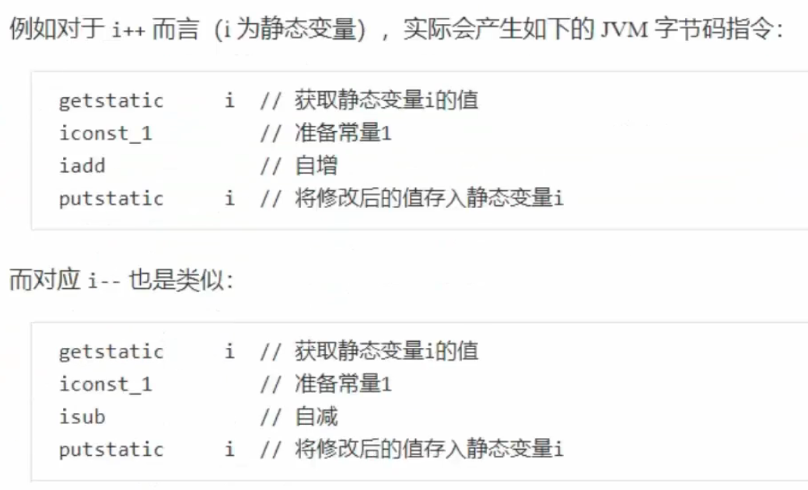
>
>       
>
>   *   解决方法：用Synchronized解决并发问题


3.   可见性

>   *   问题提出：先来看一个现象，main线程对run变量的修改对于t线程来说不可见，导致了t线程无法停止
>
>       ```java
>       static boolean run = true;
>       
>       public static void main(String[] args) throws InterruptedException {
>           Thread t = new Thread(() -> {
>               while (run) {
>                   // ...
>               }
>           });
>           t.start();
>           
>           Thread.sleep(1000);
>           run = false; // 线程t不会如预想的停下来
>       }
>       ```
>
>   *   问题分析：
>
>       1.   初始状态，t线程刚开始从主内存读取了run的值到工作内存
>
>            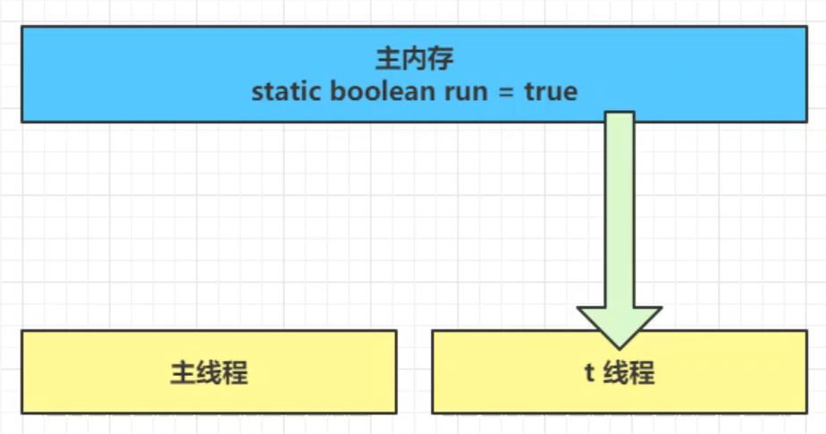
>
>       2.   因为t线程要频繁从主内存中读取run的值，JIT编译器会将run的值缓存至自己工作内存中的高速缓存中，减少对主存中run的访问，提高效率
>
>            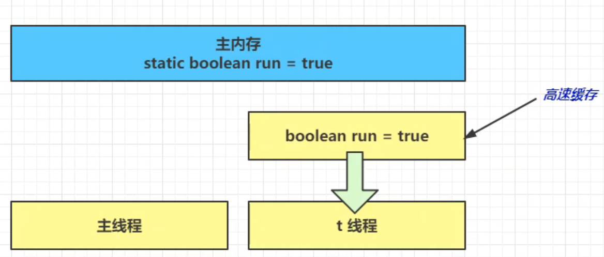
>
>       3.   1秒后，main线程修改了run的值，并同步至主存，而t是从自己工作内存中的高速缓存中读取这个变量的值，结果永远是旧值
>
>            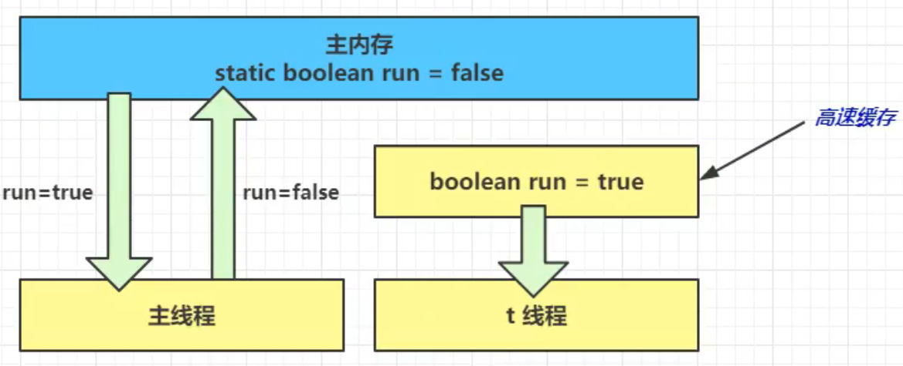
>
>   *   解决方法：适用volatile易变关键字，它可以用来修饰成员变量和静态成员变量，可以避免线程从自己的工作缓存中查找变量的值，必须到主存中获取它的值，线程操作volatile变量都是直接操作主存


3.   有序性

>   *   问题提出：I_Result是一个对象，有一个属性r1用来保存结果，问可能的结果有几种？
>
>       ```java
>       int num = 0;
>       boolean ready = false;
>       
>       // 线程1执行此方法
>       public void actor1(I_Result r) {
>           if (ready) {
>               r.r1 = num + num;
>           } else {
>               r.r1 = 1;
>           }
>       }
>       
>       // 线程2执行此方法
>       public void actor2(I_Result r) {
>           num = 2;
>           ready = true;
>       }
>       ```
>
>   *   问题分析
>
>       情况1：线程1先执行，这时ready=false，所以进入else分支结果为1
>
>       情况2：线程2先执行num=2，但没来得及执行ready=true，线程1执行，还是进入else分支，结果为1
>
>       情况3：线程2执行到ready=true，线程1执行，这回进入if分支，结果为4
>
>       但其实还有一种情况：线程2执行ready=true，切换到线程1，进入if分支，相加为0，再切回线程2执行num，此时结果为0。这种现象叫做指令重排，是JIT编译器在运行时的一些优化。
>
>   *   解决方法：适用volatile修饰的变量可以禁用指令重排


# 5. JVM调优

1.   JVM参数

>   *   -Xss size
>
>       指定虚拟机栈空间大小，一般默认1024KB，如果是Windows系统则会根据虚拟内存进行分配
>       
>   *   -Xms
>
>       堆初始大小
>
>   *   -Xmx 或 -XX:MaxHeapSize=size
>
>       堆最大大小
>
>   *   -Xmn 或 (-XX:NewSize=size + -XX:MaxNewSize=size)
>
>       新生代大小
>
>   *   -XX:InitialSurvivorRatio=ratio 和 -XX:+UseAdaptiveSizePolicy
>
>       幸存区比例(动态)
>
>   *   -XX:SurvivorRatio=ratio
>
>       幸存区比例
>
>   *   -XX:MaxTenuringThreshold=threshold
>
>       晋升阈值
>
>   *   -XX:+PrintTenuringDistribution
>
>       晋升详情
>
>   *   -XX:+PrintGCDetails -verbose:gc
>
>       GC详情
>
>   *   -XX:+ScavengeBeforeFullGC
>
>       FullGC前MinorGC


2.   常用命令工具

>   *   JPS：Java Process Status，输出JVM中运行的进程状态信息（现在一般使用jconsole）
>   *   jstack：查看java进程内线程的堆栈信息
>   *   jmap：用于生成堆转存快照
>       *   jmap [options] pid 内存映像信息
>       *   jmap -heap pid 显示Java堆的信息
>       *   jmap -dump format=b,file=heap.hprof pid
>           *   format=b表示以hprof二进制格式转储Java堆的内存
>           *   file=用于指定快照dump文件的文件名
>   *   jhat：用于分析jmap生成的堆转存快照（一般不推荐使用，而是使用Ecplise MemoryAnalyzer）
>   *   jstat：是JVM统计监测工具。可以用来显示垃圾回收信息、类加载信息、新生代统计信息等


3.   Java内存泄漏排查思路

>   1.   适用jmap指定打印它的内存快照dump
>        *   -XX:+HeapDumpOnOutOfMemoryError
>        *   -XX:HeapDumpPath=/home/app/dumps 指定生成后文件的保存目录
>   2.   通过工具如VisualVM去分析dump文件
>   3.   通过查看堆信息的情况，可以大概定位内存溢出是哪行代码出了问题
>   4.   找到对应的代码，通过阅读上下文的情况，进行修复即可


4.   Java程序CPU占用过多如何定位

>   1.   使用top命令定位哪个进程对cpu的占用过高
>
>   2.   使用ps命令进一步定位是哪个线程引起的cpu占用过高
>
>        `ps H -eo pid,tid,%cpu | grep 进程id`
>
>   3.   使用jdk提供的工具查看哪个线程出现问题
>
>        `jstack 进程id`
>
>        将第二步获取到的线程id换算成十六进制，在jstack中寻找对应的问题线程，进一步定位到问题代码的源码行号