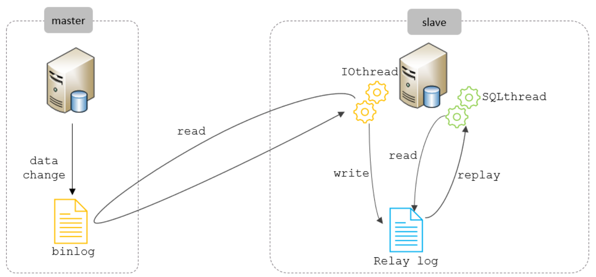

# MySQL相关面试题


# 一、SQL规范

## 1. MySQL查询语句的执行顺序

>   *   编写
>
>   ```mysql
>   select 字段
>   from 表名
>   join ... on 表关联
>   where 条件查询
>   group by 分组字段
>   having 分组后的条件
>   order by 排序字段
>   limit 分页
>   ```
>
>   *   顺序
>
>   from -> join ... on ... -> where -> group by -> having -> select -> order by -> limit


## 2. 多表关系

>   *   一对一：在任意一方设置外键关联一的一方的主键，或保证两张表的主键一致，常用于拆分表
>   *   一对多：多的一方设置外键关联一的一方的主键
>   *   多对多：需要建立中间表，中间表中包含两个外键关联两张表的主键


## 3. 多表查询方式

>   1.   内连接
>        *   隐式：`select * from 表1, 表2 where 条件...`
>        *   显式：`select * from 表1 join 表2 on 条件...`
>   2.   外连接
>        *   左外连接：`select * from 表1 left join 表2 on 条件...`
>        *   右外连接：`select * from 表1 right join 表2 on 条件...`
>   3.   自连接：`select * from 表1 as 名1, 表2 as 名2 where 条件...`
>   4.   子查询：子查询的结果放在主查询的比较条件中，分为标量子查询、单行子查询、单列子查询、表子查询
>   5.   还可以使用union进行联合查询，作用是连接两个select语句的结果到一个结果集中，此外还可以使用更高效的union all，union会进行去重，union all不会进行去重
>   6.   SQL99语法新特性中还提供了自然连接和using连接，自然连接使用natural join关键字，会自动查询两张连接表中所有相同字段；using用于替换on，同名字段可以直接用using连接


## 4. 内连接与外连接的区别

>   1.   内连接只会查询出匹配到的数据
>   2.   外连接不仅会查出匹配到的数据，还会查出主表匹配不到的数据，说白了就是可以查出null


## 5. char和varchar的区别

>   *   char：定长字符串，最大长度为255字符，存储效率快，但可能造成空间浪费
>   *   varchar：可变长字符串，最大长度为65535字符，优点是节省空间，缺点是每次存储会计算占用长度导致效率降低


# 二、事务

## 1. 什么是事务

>   就是一组逻辑操作单元，使数据从一种状态转变为另一种状态


## 2. 事务的四大特性ACID

>   1.   原子性：事务是一个不可再分的单位，要么全部成功，要么全部失败
>   2.   一致性：事务总是从一个合法状态转变为另一个合法状态
>   3.   隔离性：各事务间不会相互干扰
>   4.   持久性：事务一旦提交，对数据的修改就是永久性的，通过事务日志来实现，即使系统崩溃也不会影响到数据


## 3. 并发事务可能产生的问题

>   1.   脏写：事务A修改了事务B修改过但尚未提交的数据，一般绝对不允许发生
>   2.   脏读：事务A访问事务B修改过但尚未提交的数据，这个数据就是脏数据，如果事务B发生回滚，那么事务A读到的数据就是临时且无效的
>   3.   不可重复读：事务A读取数据后，事务B更改了这个数据，事务A再次读取，发现前后读取到的数据值不一致，则产生不可重复读
>   4.   幻读：事务A读取表中数据后，事务B进行了插入操作，当A再次读取就会发现多了一些原本不存在的数据，则产生了幻读
>
>   ---
>
>   额外问题：A读取后，B删除了一些数据，A再次读取发现数据变少了，这属于不可重复读。幻读是指读到了没有读到的数据，这个例子中相当于每一条变少的数据都发生了不可重复读


## 4. MySQL的四种隔离级别

>   1.   读未提交：事务可以读到其它未提交事务的执行结果，可以解决脏写问题，但不能解决脏读问题
>   2.   读已提交：事务可以读到其它已提交事务的执行结果，可以解决脏读问题，但不能解决不可重复读问题。很多的数据库如Oracle、SQL server的默认隔离级别是这一级，但MySQL不是
>   3.   可重复读：A读取数据后，B对数据进行了修改并提交，A再次读取不会读到修改后的数据，可以解决不可重复读问题，但不能解决幻读问题，这是MySQL的默认隔离级别
>   4.   可串行化：在事务执行期间，禁止其它事务对该表进行增删改操作，可以避免事务并发问题，但性能低


# 三、索引

## 1. MySQL的存储引擎

>   1.   InnoDB
>        *   MySQL从5.5版本开始默认采用InnoDB存储引擎
>        *   InnoDB是具备外键支持功能的事务存储引擎
>        *   对于数据文件结构，表名.frm用于存储表结构，表名.ibd用于存储数据和索引，在8.0版本全部合并存在.ibd文件中
>        *   与MyISAM相比，InnoDB写的处理效率较差，并且会占用更多的磁盘空间用以保存数据和索引，对内存要求较高，内存大小对性能有决定性的影响
>   2.   MyISAM
>        *   MyISAM是5.5版本前的默认存储引擎
>        *   MyISAM的优点是访问的速度快，但不支持事务、行级锁、外键，并且系统崩溃后无法安全恢复，适用于对事务没要求且以Insert、Select为主的应用
>        *   对于数据文件结构，表名.frm存储表结构，表名.MYD存储数据，表名.MYI存储索引
>   3.   MEMORY
>        *   顾名思义在内存中存储，所以速度快，但不安全，只适合存小量需要快速访问的数据
>   4.   其它...


## 2. 什么是索引

>   1.   是一种帮助MySQL高效获取数据的数据结构
>   2.   本质可以理解为排好序的快速查找结构
>
>   以InnoDB为例，MySQL索引底层的数据结构是改良的B+树，迭代历程：
>
>   一个数据页中存多条数据 -> 多个数据页存大量数据 -> 目录项记录每个数据页的第一条数据 -> 使用目录页记录目录项 -> 多个目录页 -> 目录项记录目录页的第一条数据，各目录页、数据页用双向指针连接，各数据项用单向指针连接


## 3. InnoDB中聚簇索引与非聚簇索引

>   在InnoDB存储引擎中，根据索引的存储形式可以分为聚簇索引和二级索引
>
>   *   聚簇索引：B+树的叶子节点存储的是完整的用户数据
>   *   二级索引：目录项存储的是索引的列和列表的主键


## 4. 回表查询

>   先到二级索引中查找数据，找到主键值后再到聚簇索引根据主键值查询数据，这种获取数据的方式就是回表查询


## 5. 最左前缀匹配原则

>   MySQL使用联合索引查询时会遵循最左前缀匹配原则，即在检索数据时从联合索引的最左边开始匹配，如果当中有某个字段与条件字段不匹配了，则索引从这个字段及往后的字段都会失效。如果第一个字段就不匹配，那么这个索引不会被命中


## 6. 什么是覆盖索引

>   一个索引被命中且包含了所有需要使用的字段就称为索引覆盖
>
>   好处：
>
>   1.   减少了回表操作，即减少了I/O次数，有效提升性能
>   2.   由于覆盖索引是按值的顺序存储的，对IO密集型的范围查找来说，对比随机从磁盘读取每一行的数据IO要少的多，因此利用覆盖索引在访问时也可以把磁盘的随机读取的IO转变成索引查找的顺序IO，即可以把随机I/O变为顺序I/O，加快查询效率
>
>   坏处：
>
>   *   可能产生冗余索引或索引过多引发性能问题，平衡优劣应交由业务数据架构师来做


## 7. 索引下推

>   索引下推(ICP)也称为索引条件下推(Index Condition Pushdown)，使用索引查询时，如果存在索引列作为判断条件时，服务层会将这一部分判断条件传递给存储引擎，存储引擎通过索引查询数据后也会筛选出符合传递条件的索引项，即在存储引擎层根据索引条件过滤掉不符合条件的索引项，然后再进行回表查询。


## 8. 限制索引的数目

>   1.   在实际开发中，索引并不是越多越好，一般每张表的索引数量不会超过6个
>   2.   每个索引都会占用磁盘空间，索引越多，需要的磁盘空间就越大
>   3.   索引的存在会影响表增、删、改的性能
>   4.   我们执行SQL的DQL语句时，MySQL优化器会针对每一个可以使用的索引进行评估，以得到最优的执行方案，如果索引过多，会增加优化器生成计划的时间，从而降低查询效率


## 9. 哪些情况适合创建索引

>   1.   字段的数据有唯一性约束限制
>   2.   经常group by、order by的字段
>   3.   经常作为where查询条件的字段
>   4.   distinct字段可以考虑创建索引
>   5.   散列性高的列适合创建索引
>   6.   使用字符串前缀创建索引
>   7.   尽量使用联合索引，使用最频繁的列放在联合索引的左侧


## 10. 哪些情况不适合创建索引

>   1.   更新频繁的字段
>   2.   有大量重复数据的列
>   3.   使用较少或从来不做where查询的条件的列
>   4.   不建议用无序的值创建索引
>   5.   不建议用数据类型较大的字段创建索引
>   6.   数据量小的表一般不创建索引


# 四、调优

## 1. 定位慢查询

>   可以通过慢查询日志定位慢查询。MySQL的慢查询日志是用来记录在MySQL中响应时间超过阈值的语句，阈值的默认值是10s，它能够帮我们发现那些执行超时的SQL语句，从而进行针对性优化。一般结合Explain进行分析，并且如果不是进行调优，一般不开启慢查询日志，因为慢查询日志或多或少会带来一些性能损耗


## 2. 如何分析SQL语句

>   
>
>   type字段：性能由好到差的连接类型为null -> system -> const -> eq-ref -> ref -> range -> index -> all
>
>   *   [这篇文章讲的还蛮好的](https://blog.csdn.net/why15732625998/article/details/80388236)


## 3. 索引失效的情况

>   1.   未满足最左前缀匹配
>   2.   范围查询右边的列索引失效
>   3.   在语句中进行运算或类型转换
>   4.   or前后存在非索引的列
>   5.   模糊查询以通配符开头
>   6.   使用not或 != 索引失效
>   7.   优化器评估全表查询效率更高的情况


## 4. MySQL超大分页处理

>   在实际生产中一般不会出现大数据进行分页查询的情况，因为对性能的销毁非常大，如果真的出现需要超大分页的场景：
>
>   1.   使用子查询将需要查找的范围查找出来，再根据索引查询
>   2.   可以考虑索引覆盖
>   3.   必须建立索引
>   4.   避免使用select \*
>
>   此外，还可以考虑深度分页


## 5. SQL优化经验

>   1.   存储引擎方面
>        *   以insert、select为主，对事务没有要求可以使用MyISAM
>        *   需要事务支持，以增删改查为主可以使用InnoDB
>   2.   表设计方面
>        *   各字段的数据类型应尽可能地小，且应考虑执行效率
>   3.   索引设计方面
>        *   建议设置索引的情况
>            1.   字段的数据有唯一性约束限制
>            2.   经常group by、order by的字段
>            3.   经常作为where查询条件的字段
>            4.   distinct字段可以考虑创建索引
>            5.   散列性高的列适合创建索引
>            6.   使用字符串前缀创建索引
>            7.   尽量使用联合索引，使用最频繁的列放在联合索引的左侧
>        *   不建议设置索引的情况
>            1.   更新频繁的字段
>            2.   有大量重复数据的列
>            3.   使用较少或从来不做where查询的条件的列
>            4.   不建议用无序的值创建索引
>            5.   不建议用数据类型较大的字段创建索引
>            6.   数据量小的表一般不创建索引
>   4.   SQL语句优化
>        *   尽量避免索引失效情况
>            1.   未满足最左前缀匹配
>            2.   范围查询右边的列索引失效
>            3.   在语句中进行运算或类型转换
>            4.   or前后存在非索引的列
>            5.   模糊查询以通配符开头
>            6.   使用not或 != 索引失效
>            7.   优化器评估全表查询效率更高的情况
>        *   避免使用select \*
>        *   只需要一条数据可以用limit 1
>        *   考虑用union all替代union
>        *   多表查询尽量使用内连接，使用外连接时要小表驱动大表
>   5.   主从复制，读写分离
>        *   主数据库处理事务性增删改操作
>        *   从数据库处理查询操作
>   6.   分库分表


# 五、分库分表

## 1. 主从复制原理

>   MySQL主从复制的核心就是二进制日志。二进制日志(BinLog)记录了所有DDL语句和DML语句，不包括数据查询语句。
>
>   
>
>   1.   master主库在事务提交时，会把数据变更记录在二进制日志文件Binlog中
>   2.   slave读取主库的二进制日志文件Binlog，写入到从库的中继日志RelayLog中
>   3.   slave重做中继日志中的事件，从而对数据进行同步


## 2. 主从同步延时问题

>   为什么会产生主从同步延时问题：
>
>   1.   MySQL的主从复制都是单线程的操作，主线程写入Binlog日志时是顺序写入，效率很高。slave重做中继日志时是随机IO，成本高很多，所以SQL Thread线程的速度赶不上主库写Binlog的速度，就会产生主从延迟
>   2.   由于SQL Thread是单线程的，当主库并发量较高时，新增的数量超过了slave的SQL Thread所能处理的速度，也会产生主从延迟
>   3.   当slave中有大型query语句产生了锁等待，也会产生主从延迟
>
>   解决方案：
>
>   1.   强制读主库：如果做的是类似支付这种对实时性要求非常高的业务，那么最直接的方案就是直接读主库，当然这种方法相当于从库做一个备份的功能
>   2.   延迟读：就是在写入后，等一段时间再读，但这个方案的主要存在的问题就是不知道主从同步完成所需要的时间
>   3.   降低并发：控制主库写入的速度，主从延迟发送的概率自然减小了
>   4.   并行复制（推荐）：MySQL5.6版本后，提供了一种并行复制的方式，通过将SQL线程转换为多个work线程来进行重做Binlog，这样就解决了主从延迟的问题


## 3. 为什么要分库分表

>   使用单数据库存在一些性能瓶颈：
>
>   *   IO问题：请求数据太多产生大量的磁盘IO，导致效率降低
>   *   CPU问题：请求数据太多，进行分组、排序、多表查询等操作都会耗费大量的CPU资源进行计算
>
>   通过分库分表就可以解决以上问题，它的思想就是将数据分散存储，使得单一数据库、表的数据量变小来缓解单一数据库的性能问题。


## 4. 分库分表的拆分策略

>   *   垂直拆分
>       *   垂直分库：以表为依据，根据业务不同拆分到不同库中
>           *   每个库的表都不相同
>           *   每个库的数据都不相同
>           *   所有库加起来才是全量数据
>       *   垂直分表：以字段为依据，根据字段属性将不同字段拆分到不同表中
>           *   每表的结构都不相同
>           *   每表的数据都不相同
>           *   所有表加起来是全量数据
>   *   水平拆分
>       *   水平分库：以字段为依据，将一个库的数据拆分到多个库中
>           *   每个库的表是相同的
>           *   每个库的数据都不相同
>           *   所有库加起来才是全量数据
>       *   水平分表：以字段为依据，将一个表的数据拆分到多个表
>           *   每个表的结构是相同的
>           *   每个表的数据都不相同
>           *   所有表加起来是全量数据


## 5. 分库分表的实现技术

>   *   shardingJDBC：基于AOP原理，在应用程序中对本地执行的SQL进行拦截，然后解析、改写和做路由处理。需要自行编码实现，只支持java语言，性能较高。
>   *   MyCat：数据库分库分表中间件，不用调整代码即可实现分库分表，支持多种语言，性能不及前者。


# 六、锁

## 1. 按锁的粒度划分，MySQL中有哪几种锁？

>   *   全局锁：每次操作锁定数据库中的所有表
>
>   除全局锁外，主要有三种：
>
>   *   表级锁：MyISAM引擎和InnoDB引擎支持，每次操作锁定操作的表，锁定粒度较大，开销最小，但并发度较低
>   *   页级锁：BDB引擎支持，锁定粒度介于行级锁和表级锁中间
>   *   行级锁：InnoDB引擎支持，每次操作锁定操作的行，锁定粒度最小，并发性能最好，但开销较大


## 2. 介绍一下共享锁和排他锁

>   *   共享锁（Shared Lock，S锁）：有时称为读锁，针对同一份数据，多个事务的读操作可以同时进行而不会相互影响
>   *   排他锁（Exclusive Lock，X锁）：有时称为写锁，当前的写操作没有完成前，它会阻断其它的共享锁和排他锁，即只能有一个事务执行写操作，并防止其它事务读取正在写入的资源
>       *   这里的写操作主要是指删和改，插入新增操作一般是不加排他锁的，只通过一种称为隐式锁的结构来保护新增的数据在事务提交前不被其它事务访问
>
>   什么时候加锁呢？
>
>   *   正常的select语句是不会加任何锁的
>   *   执行写入操作会加排他锁
>   *   `SELECT ... LOCK IN SHARE MODE;`语句会加共享锁，目的是阻塞写操作
>   *   `SELECT ... FOR UPDATE;`语句会加排他锁，目的是阻塞其它事务获取共享锁或排他锁


## 3. 介绍一下意向锁

>   意向锁的作用：
>
>   1.   意向锁的存在是为了协调行锁和表锁的关系，支持多粒度（表锁与行锁）的锁共存。
>   2.   意向锁是一种不与行级锁冲突表级锁，这一点非常重要。
>   3.   表明“某个事务正在某些行持有了锁或该事务准备去持有锁”，以此减少数据库对表锁的检测
>
>   意向锁是由存储引擎自己维护的，用户无法手动操作意向锁，当我们为数据行加共享或排他锁之前，InnoDB会先获取该数据行所在数据表的对应意向锁。
>
>   在数据表场景中，例如现在有两个事务，分别是T1和T2，其中T2试图在该表级别上应用共享或排他锁，如果没有意向锁存在，那么T2就需要去检查各个页或行是否存在锁；但是如果有意向锁，那么T2就只需检查意向锁，不需要再检查各个页或行锁。


## 4. redo log和undo log

>   我们都知道事务的四大特性ACID，它的隔离性是由锁机制和MVCC来实现的，而原子性、一致性、持久性是通过redo和undo日志来实现的。
>
>   *   redo log称为重做日志，提供再写入的操作，用来保证事务的持久性。它是InnoDB生成的日志，记录的是物理日志，例如哪个页多少偏移量操作了什么数据。
>
>       *   解析
>
>           redo log由redo log buffer和redo log file组成，缓冲池存在于内存中，redo log file存在于磁盘中。我们在访问数据页之前，需要把在磁盘上的数据页缓存到缓冲池中才可以访问，所有的修改操作都必须先更新缓冲池中的数据，然后缓冲池中的脏页会根据checkPoint机制以一定的频率被写入redo log file，最终再同步到数据库中。InnoDB引擎的事务采用了WAL技术（Write-Ahead Logging），这种技术的思想就是先写日志，再写磁盘，只有日志写入成功，才算事务提交成功。而缓冲池的作用就是来优化CPU和磁盘之间的鸿沟，这样能保证整体的性能不会下降太快。
>
>       *   优点
>
>           *   因为它只记录操作，占用的空间小，降低了刷盘频率
>           *   redo日志是顺序写入的，顺序IO比随机IO会快很多，在事务的执行过程中，redo log会不断地进行记录
>
>   *   undo log称为回滚日志，用于回滚行记录到某个特定版本，保证事务的原子性和一致性。它记录的是每个修改操作的逆操作，是逻辑日志，例如你执行了insert操作它就会记录一条delete操作，执行了delete操作它就会记录一条insert操作，执行了update操作它就会记录一条update操作将其更改为更改前的数据。
>
>       *   解析
>
>           当我们的事务执行到一半时出现了一些错误，或者说整个服务器产生错误，又或者直接断电了，这时候为了保证事务的原子性就需要使用undo日志执行回滚操作。
>
>       *   优点
>
>           *   提供回滚和MVCC
>
>   注：这里所说的修改操作指的是增删改操作


## 5. redo log和bin log的区别

>   redo log是存储引擎层产生的，而bin log是数据库层产生的。假设一个事务对表做了10w行的记录插入，在这个过程中一直不断地往redo log顺序记录，而bin log不会记录，直到这个事务提交后才会一次写入到bin log文件中。而且bin log是不一定会写入成功的，而redo log是一定要写入成功事务才能提交的，bin log如果没有成功，就可以通过redo log来重新写入，保证事务的持久性。


## 6. MVCC

>   MVCC全称Multi-Version Concurrency Control，即多版本并发控制，用于维护一个数据的多个版本，使得读写操作没有冲突。MVCC的实现依赖于数据库记录中的隐藏字段、undo log、readView。
>
>   *   隐藏字段：在一个数据表中除了我们自己设置的字段外，还有三个隐藏字段分别是DB_TRX_ID、DB_ROLL_PTR、DB_ROW_ID
>
>       *   DB_TRX_ID：最近修改事务的ID，记录插入这条记录或最后一次修改该记录的事务ID，默认为1，每次修改后进行自增
>       *   DB_ROLL_PTR：回滚指针，指向这条记录的上一个版本，用于配合undo log一起使用
>       *   DB_ROW_ID：隐藏主键，如果表结构没有指定主键，将会生成该隐藏字段
>
>       因此每次修改一个字段，至少会修改一次事务ID和回滚指针。
>
>   *   undo log：在执行增删改操作时候产生的便于数据回滚的数据。当insert时，产生的undo日志在事务提交后就会被删除，而update和delete操作产生的undo日志不仅在回滚时需要，MVCC版本访问也需要，不会被立即删除。它里面其实是以一个版本链的方式进行存储。
>
>   *   readView：即读视图，是快照读SQL执行时MVCC提取数据的依据，记录并维护系统当前活跃的事务（即未提交的事务）id。
>
>       *   当前读：读取的是记录的最新版本且需要保证其它并发事务不能修改当前记录，会对读取的记录进行加锁。其它事务进行读取时，即使遇到阻塞也要拿到最新的数据。
>       *   快照读：普通的不加锁select就是快照读，读取的是记录数据的可见版本，有可能是历史数据，不加锁，是非阻塞读。
>           *   Read Committed：每次select都生成一个快照读
>           *   Repeatable Read：开启事务后第一次执行select语句才生成快照读
>       *   Read View包含了四个核心字段：
>           *   m_ids：当前活跃的事务ID集合
>           *   min\_trx\_id：最小活跃事务ID
>           *   max\_trx\_id：预分配事务ID，当前最大事务ID+1（因为事务ID是自增的）
>           *   creator\_trx\_id：ReadView创建者的事务ID

