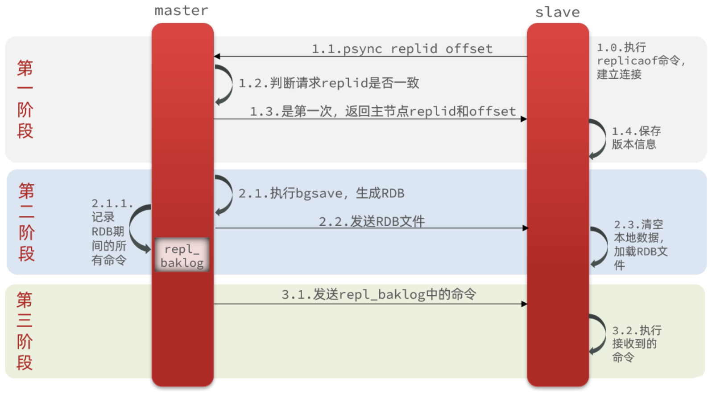
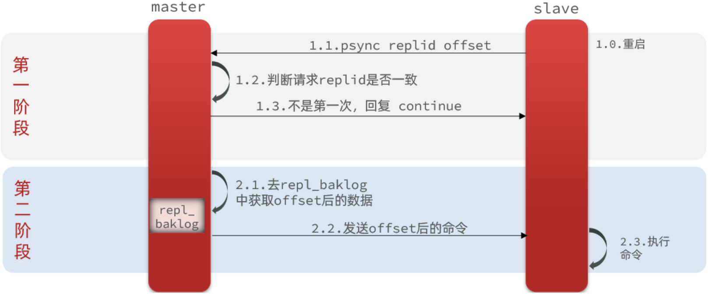
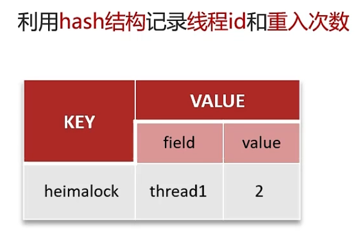

# Redis

# 一、Redis基础

## 1. Redis为什么快

>   1.   Redis是纯内存操作，C语言编写
>   2.   Redis是单线程操作
>   3.   数据简单，数据操作也相对简单
>   4.   Redis采用epoll作为I/O多路复用技术的实现

## 2. Redis是单线程的吗

>   Redis是单线程的吗？
>
>   *   Redis4.0以前是完全单线程的
>
>   *   从Redis4.0开始支持后台线程工作，即执行IO和读写数据使用单线程，执行数据持久化等操作使用多线程
>   *   Redis6.0引入多线程IO，但只是用于处理网络数据的读写和协议的解析，而执行命令依旧是单线程
>
>   为什么是单线程？
>
>   1.   单线程模式方便开发调试
>   2.   Redis内部使用了基于epoll的多路复用
>   3.   Redis主要的性能瓶颈是内存和网络带宽

## 3. RDB

>   什么是RDB？
>
>   *   RDB全称Redis Database Backup file，是Redis数据备份文件，也被称为Redis数据快照，用于将当前内存中的数据记录到磁盘中，记录的是二进制数据并进行压缩
>
>   什么时候会执行RDB？
>
>   1.   手动执行
>        *   save：会阻塞主进程
>        *   bgsave：后台执行
>   2.   Redis停机时执行
>   3.   触发设定的RDB条件
>        *   save 300 10：表示300秒内如果有10个key被修改就执行
>
>   RDB写时复制？
>
>   *   后台执行RDB时会通过Linux的fork函数复制主进程的信息得到子进程，它会有与主进程相同的指针指向内存中的数据页，子进程就通过指针读取内存数据写入RDB文件
>   *   由于主进程和子进程都可以获取这份数据，也就是说这份数据是共享的
>   *   当主进程执行读操作时，直接访问共享内存
>   *   当主进程执行写操作时，就会拷贝一份对应的数据执行写操作，完成写操作后数据页指向旧数据的指针就会指向新的数据
>   *   当RDB执行完后，操作系统就会回收那些没有被引用的数据

## 4. AOF

>   什么是AOF？
>
>   *   AOF全称Append Only File，是追加文件。Redis处理的每一个写命令都会记录在AOF文件，记录的是命令。
>
>   AOF的同步频率？
>
>   *   Always：同步刷盘，可靠性高，几乎不丢失数据，但是性能消耗大
>   *   everysec：每秒刷盘，性能适中，最多会丢失一秒的数据
>   *   no：操作系统控制刷盘，性能最好，但是可靠性差，可能会丢失大量数据
>
>   AOF的文件重写：
>
>   *   因为一个key可能会产生多次的写操作，但只有最后一次的写操作才有意义，因此AOF文件重写能够读取内存然后对每个key生成一条写操作记录到AOF文件中
>   *   可以通过bgrewriteaof命令开启AOF文件重写，Redis也会在触发我们设定的重写条件时进行重写，例如增长超过多少百分比、文件体积到达多大

## 5. RDB与AOF对比

>   RDB和AOF各有自己的优缺点，如果对数据安全性要求较高，在实际开发中往往会结合两者来使用
>
>   |                | RDB                                  | AOF                                                        |
>   | -------------- | ------------------------------------ | ---------------------------------------------------------- |
>   | 持久化方式     | 定时对整个内存做快照                 | 记录每一次执行的命令                                       |
>   | 数据完整性     | 不完整，两次备份之间数据会丢失       | 相对完整，取决于同步频率                                   |
>   | 文件大小       | 相对较小，记录二进制文件并压缩       | 相对较大，记录的是每条数据的命令                           |
>   | 宕机恢复速度   | 很快                                 | 慢                                                         |
>   | 数据恢复优先级 | 数据完整性不如AOF，优先级低          | 数据完整性较好，优先级高                                   |
>   | 系统资源占用   | 消耗大量CPU和内存，资源占用高        | 主要是磁盘IO，消耗低，但AOF文件重写依旧会占用大量CPU和内存 |
>   | 使用场景       | 可用容忍部分数据丢失，追求执行速度快 | 对数据安全性要求较高                                       |

## 6. Redis的全量复制

>   
>
>   我们可以在某个节点中执行`slaveof 目标IP 目标port`来使当前节点作为目标节点的slave节点，主从在第一次建立连接时会进行全量复制。
>
>   1.   slave向master发起数据同步请求，如果有replid和offset的话也会发送给master
>        *   Replication Id：简称replid，是数据集的标记，id一致则说明是同一数据集，每一个master 都有唯一的replid，slave会继承master节点的replid
>        *   offset：偏移量，随着记录在repl_baklog中的数据增多而逐渐增大
>   2.   master判断replid是否与自己的一致或偏移量是否被覆盖，如果不一致或偏移量被覆盖则执行全量复制，否则会执行增量复制
>   3.   如果执行全量复制，则返回replid和offset给slave，slave接收到后保存版本信息
>   4.   master执行`bgsave`，生成RDB文件并发送给slave，slave接收到后会清空本地数据并加载RDB文件
>   5.   master在记录RDB文件的期间可能会继续产生写操作，这时会使用repl_baklog文件来记录这些写操作命令并持续发送给slave
>        *   repl_baklog：记录Redis处理过的命令日志及offset，包括master当前的offset和slave已经拷贝到的offset，是一个固定大小的环形数组。
>   6.   slave执行接收到的命令，并会一直保持与master之间的同步
>   7.   至此全量同步完成

## 7. Redis的增量复制

>   
>
>   1.   slave向master发起数据同步请求，并将自己的replid和offset发送给master
>   2.   master判断replid是否和自己的相同，并判断offset是否未被覆盖，如果都是则进行增量同步并回复continue，否则进行全量同步
>   3.   如果执行增量同步，master从repl_baklog中获取offset后的数据并发送给slave
>   4.   slave执行接收到的命令
>   5.   至此增量同步完成

## 8. Redis事务

>   Redis的事务的本质是一组命令的批处理，不具备像DBMS一样的ACID特性。这组命令在执行过程中会被顺序地一次性执行完毕，只要没有出现语法错误，这组命令在执行期间是不会被中断的。
>
>   *   这组命令中的某些命令的执行失败不会影响到其它命令的执行，不会引发回滚
>   *   这组命令仅通过乐观锁实现简单的隔离性，没有复杂的隔离级别
>   *   这组命令的执行结果是被写入内存的，是否持久化取决于Redis的持久化策略，与事务无关

## 9. Redis有哪些数据结构

>   五种基本数据类型：
>
>   *   String：字符串，大部分的字符串都是简单动态字符串(SDS)，内部编码有三种：int(8字节长整型)、embstr(小于等于39字节字符串)、raw(大于39字节字符串)
>   *   Hash：哈希，底层实现可以是ziplist和hashtable
>   *   List：列表，底层实现可以是ziplist和linkedlist
>   *   Set：集合，底层实现可以是intset和hashtable
>   *   ZSet：有序集合，底层实现可以是ziplist和skiplist
>
>   四种特殊数据结构：
>
>   *   BitMap：位图，本质上就是一个简单动态字符串，通过每一位的0和1存储信息
>   *   HyperLogLog：超级日志记录，可对数据量超级庞大的数据去重计数统计，Redis官方给出的误差是0.81%，这个误差对于大多数超级大数据量场景是被允许的
>   *   Geospatial：地理空间，本质是一个集合，其中的元素由经度、纬度、位置名称组成
>   *   Stream：用于实现典型的消息队列

## 10. Redis如何处理过期key

>   假设Redis当前存放了30w个设置了过期时间的key，如果我们每隔100ms就去检查这全部的key，CPU的负载会特别高，甚至可能会挂掉，对此Redis同时使用了定时过期和惰性过期两种过期策略来处理过期key。
>
>   *   定时过期：redis默认每秒运行10此对具有过期时间的key进行一次扫描，每次默认随机扫描20个key，同时删除这20个key中已经过期的key，如果这20个key中过期的比例超过25%，则继续执行定时过期策略。
>   *   惰性过期：尽管采用了定时过期策略，但还是可能有很多的已过期key未被删除，这时redis采用惰性过期策略，在我们获取到某个key时，redis会检测这个key是否已过期，如果过期了则删除这个key
>
>   这个策略可以最大化地节省CPU资源，却对内存非常不友好，因为极端情况下可能会出现大量过期的key没有被再次访问，从而不会被删除，导致占用大量内存。如果定期删除漏掉了很多过期的key，然后也没有采用惰性过期策略的话，Redis会用8中内存淘汰策略。

## 11. Redis内存淘汰策略

>   两种算法：
>
>   *   LRU：Least Recently Used最近最少使用，与时间相关，当内存不够时抛弃最久没有使用的数据
>   *   LFU：Least Frequently Used最不常用，与次数相关，当内存不够时抛弃最少使用的数据
>
>   八种策略：
>
>   *   volatile-lru：针对设置了过期时间的key，使用lru算法进行淘汰
>   *   allkeys-lru：针对所有key使用lru算法进行淘汰
>   *   volatile-lfu：针对设置了过期时间的key，使用lfu算法进行淘汰
>   *   allkeys-lfu：针对所有key使用lfu算法进行淘汰
>   *   volatile-random：针对设置了过期时间的key，使用随机淘汰的方式进行淘汰
>   *   allkeys-random：针对所有key使用随机淘汰的方式进行淘汰
>   *   volatile-ttl：删除生存时间最近的一个key
>   *   noeviction：默认策略，不删除任何数据，内存不足直接报错

## 12. Redis虚拟内存机制

>   Redis 的 VM (虚拟内存)机制就是暂时把不经常访问的数据(冷数据)从内存交换到磁盘中，从而腾出宝贵的内存空间用于其它需要访问的数据(热数据)。通过 VM 功能可以实现冷热数据分离，使热数据仍在内存中、冷数据保存到磁盘。这样就可以避免因为内存不足而造成访问速度下降的问题。
>
>   Redis 提高数据库容量的办法有两种：一种是可以将数据分割到多个 Redis Server上；另一种是使用虚拟内存把那些不经常访问的数据交换到磁盘上。

## 13. Redis为什么用跳表不用平衡树

>   1.   跳表的时间复杂度和红黑树一样，但实现起来是更简单的
>   2.   红黑树在插入和删除的时候可能需要进行一些balance的操作，可能涉及到整个树的其它部分，而跳表只需要修改前后指针，所需要盯住的节点更少
>   3.   跳表的内存占用更少，在redis中平均每个节点持有1.33个指针，而红黑树每个节点都持有两个指针

# 二、缓存

## 1. Redis数据如何保证数据一致性

>   当我们更新数据时，主要是讨论两类问题，一类是选择修改缓存还是删除缓存，一类是选择先修改数据库还是先操作缓存。
>
>   **修改缓存还是删除缓存？**
>
>   *   一般情况下建议删除缓存，修改一个缓存的代价有时候是很高的，有可能需要查多表、进行计算等操作，而选择删除缓存的话，等到它需要被使用到时才会存入缓存，这样可以节省一部分性能。
>   *   此外，如果选择修改缓存，在修改缓存后进行修改数据库时可能出现网络出现异常导致修改数据库失败，那这时缓存中的数据就是脏数据，不过可以通过重试机制解决这个问题。
>   *   而且如果选择先修改数据库再修改缓存，在高并发场景中可能会出现覆盖缓存的情况，导致缓存中的数据是脏数据。
>
>   **先修改数据库，再删除缓存的情况：**
>
>   *   如果选择先修改数据库，再删除缓存，在修改数据库后进行删除缓存时可能出现网络出现异常导致修改数据库失败，那这时缓存中的数据就是脏数据，不过可以通过重试机制解决这个问题，利用消息队列异步删除缓存，需要保证消息的可靠消费。
>
>   **先删除缓存，再修改数据库的情况：**
>
>   *   如果选择先删除缓存，再修改数据库，假设在高并发场景下有一个修改请求和一个读取请求同时发送过来，修改请求删除缓存后修改数据库时因为网络原因遇到阻塞，读取请求在查询缓存后未找到数据，就会去查询数据库并将旧数据进行缓存，修改请求再进行数据库修改后，那么这时缓存中的数据就是脏数据。
>   *   对于这种情况，我们可以采用延时双删来解决。在修改请求修改完数据库后，休眠一段时间再对缓存中的数据进行删除，同样的，为了避免删除失败，需要添加重试机制。
>
>   **强一致性与弱一致性问题：**
>
>   *   对于上面的情况，其实都是属于弱一致性，只能保证最终一致性。当我们的业务要求强一致性时，就需要用到锁来阻塞其它请求。
>   *   加锁其实就是CAP定理中的CP思想，保证强一致性，但由于我们添加缓存的目的就是为了快速查询、减轻数据库压力，所以实际上我们还是使用AP的情况居多。

## 2. 缓存穿透

>   什么是缓存穿透：
>
>   *   假设当前我们的项目中有某项查询工作是可以在缓存中进行查询的，如果当前缓存并没有命中，那么就需要在存储数据库中进行查询，如果存储数据库中查找到数据则会记录缓存，如果没有查询到，那么不会记录缓存。如果有多个查询这个不存在的数据的请求发送过来，那么每次都需要去存储数据库进行查询，会给数据库服务器带来压力，严重的情况可能导致数据库挂掉。
>
>   解决方案：
>
>   1.   对外只暴露网关的接口，如果是非法的请求，则在网关层就进行拦截
>   2.   如果查询存储数据库的值为空，可以把这个空值进行缓存，并设置一个合理的过期时间，如果有写请求进入更新了这个值，则需及时更新缓存，保证数据一致性
>   3.   使用布隆过滤器快速判断数据是否不存在

## 3. 缓存击穿

>   什么是缓存击穿：
>
>   *   对于设置了过期时间的key，在某个时间点这个key过期了，而恰好在这个时间点对于这个key有大量的并发请求访问，从而导致大量的请求访问存储数据库，可能会瞬间使数据库服务器挂掉。
>
>   解决方案：
>
>   1.   使用互斥锁：当缓存失效时，使用Redis的setnx去设置一个互斥锁，只有获取到锁的请求才会访问存储数据库，否则重试get缓存方法。
>        *   优点：没有额外的内存消耗，可以保证数据一致性，实现简单
>        *   缺点：线程需要等待，导致性能受限，且可能会有死锁风险
>   2.   设置key永不过期：在设置key的时候不对这个key设置过期时间，而是增加一个过期时间字段一块存入缓存中。当查询的时候，从redis取出数据后判断时间是否过期，如果过期则开通另一个线程进行数据同步，当前线程依旧正常返回数据。
>        *   优点：线程无需等待，性能较好
>        *   缺点：不能保证数据强一致性，有额外的内存消耗，实现复杂

## 4. 缓存雪崩

>   什么是缓存雪崩：
>
>   *   缓存中有多个key在某个相同的时间点过期了，而对这些key有大量的请求访问，从而导致大量的请求访问存储数据库，可能会瞬间使数据库服务器挂掉。
>
>   解决方案：
>
>   *   缓存雪崩一般是由于大量数据同时过期造成的，我们在设置key的过期时间时可以采用较大固定值+较小随机值的方式，使每个key过期时间的重复率降低
>   *   Redis故障宕机也可能引发缓存雪崩，这时需要构造Redis高可用集群

## 5. 布隆过滤器

>   什么是布隆过滤器：
>
>   *   实际上是由一个很长的二进制向量和一系列散列函数组成，主要用于判断某一个元素是否一定不在一个集合中。
>
>   插入方式：
>
>   *   在插入元素后，该元素经过布隆过滤器中一系列散列函数计算后得出一系列结果，会根据这些结果将位图上对应的二进制位的值更改为1
>
>   判断数据是否不存在：
>
>   *   对数据进行相同散列函数计算后获取一系列结果，判断在位图上对应的位置是否都为1，只要有一个不是则说明元素一定不存在，否则元素可能会存在。
>
>   布隆过滤器的局限性：
>
>   *   既然选用hash算法，必然就会存在碰撞的可能。两个不完全相同的值计算出来的hash值有可能会出现一致。因此我们可以增大位图，设计更优秀的散列函数。但随着存储的数据增多，误判的可能性也会增大，且一味地选择增大位图或增加散列函数的复杂度也可能会影响性能。
>   *   一般情况下布隆过滤器不能删除数据，不过这个问题目前有一些解决方案。

# 三、分布式

## 1. Redis的分布式锁

>   **分布式锁**，是控制分布式系统不同进程共同访问共享资源的一种锁的实现。秒杀下单、抢红包等等业务场景，都需要用到分布式锁。一般使用的是redis的 setnx + expire 两个命令共同组合实现。redis实现分布式锁的原理：就是判断一个key是否在redis中存在；如果存在则说明加锁失败，如果不存在且set命令执行成功则说明加锁成功。

## 2. Redis分布式锁存在的问题

>   Redis一般都是集群部署的，假设数据在主从同步过程，主节点挂了，Redis分布式锁可能会有哪些问题：
>
>   如果线程一在Redis的master节点上拿到了锁，但是加锁的key还没同步到slave节点。恰好这时，master节点发生故障，一个slave节点就会升级为master节点。线程二就可以获取同个key的锁，且线程一也已经拿到锁了，锁的安全性就没了。也就是分布式锁没有实现互斥。

## 3. Redisson分布式锁的底层数据结构

>   Redisson是使用redis的hash结构实现的分布式锁
>
>   

## 4. Redisson自动续期会不会无限续期造成死锁

>   我们如果使用Redisson的`Lock()`方法没有指定超时时间的话，默认的超时时间是30s，并且会自动开启`watchdog`机制进行自动续期。如果因为业务异常导致没有调用释放锁的方法，则会造成死锁。
>
>   我们可以使用`tryLock()`方法进行加锁，没有指定超时时间的话默认也是30s，时间到了则会自动删除锁，不会自动续期。我们也可以在使用`Lock()`方法时给它指定超时时间，看门狗机制执行时，会每隔30/3=10s调用`reNewExpiration()`方法刷新超时时间。

## 5. Redis脑裂问题

>   redis的集群脑裂是指因为网络问题导致master节点跟sentinel集群处于不同的网络分区，此时sentinel集群无法感知master的存在就会将slave节点提升为master节点，此时存在两个不同的master节点，就像一个大脑分裂成了两个。在产生了脑裂问题时，如果数据依旧是写入旧的master，当旧master解决网络重新连接后，会降为slave节点，并从新的master中同步数据，此时就会造成大量的数据丢失。
>
>   我们可以通过更改redis的配置，设置每个master的最少slave数量至少为3，并且设置slave连接到master的最大延迟不超过10秒，否则master会拒绝写请求，这样如果发生脑裂，最多会丢失10秒的数据。

## 6. Redis分片集群最多能有多少个集群节点

>   因为redis分片集群的个哈希槽是从0到16383一共是16384个槽，一个哈希槽可以对应一个节点，那么最多能够有16384个主节点。但因为节点间的互相通信所带来的消耗是非常大的，所以redis官方推荐我们不要超过10000个主节点。

## 7. Redis红锁RedLock

>   Redis的红锁需要通过配置多台master来实现，以此保证master不会同时挂掉，并且这些master是完全独立的，相互之间不存在数据同步，并确保在这些master是与在Redis单实例使用相同方法来获取和释放锁。
>
>   Redis的红锁就是只有在超过一半的实例上获取到了锁，才认定获取分布式锁成功。

