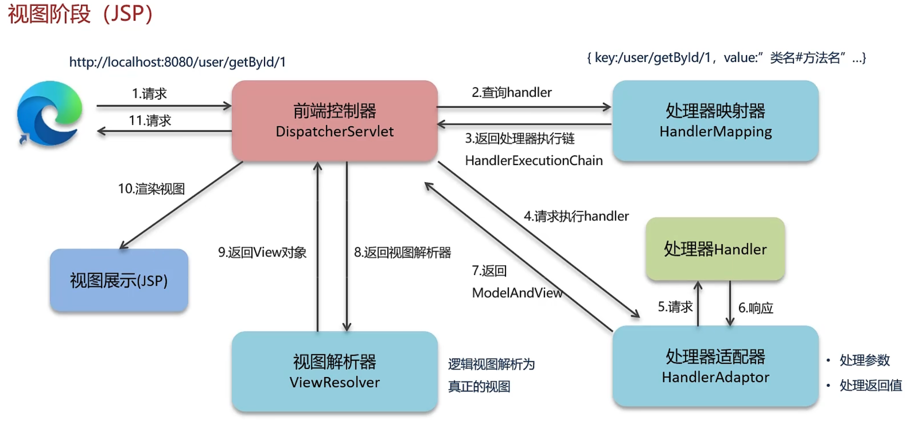
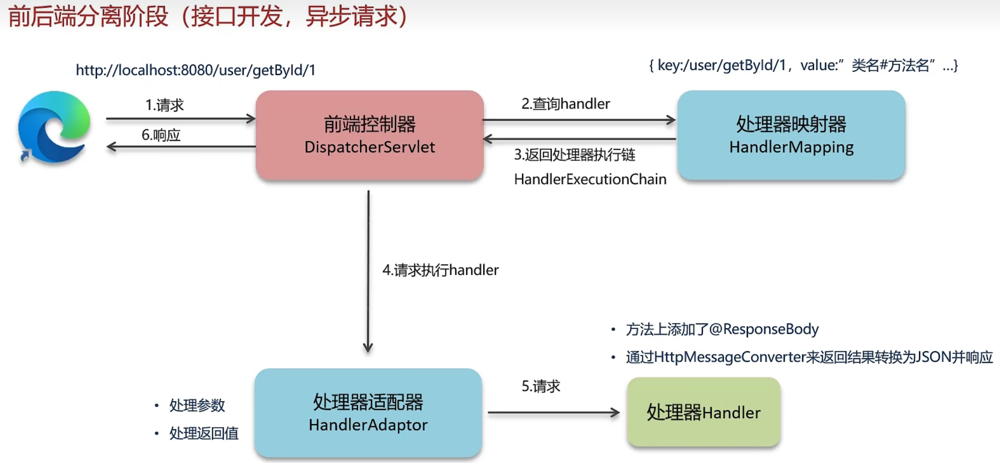
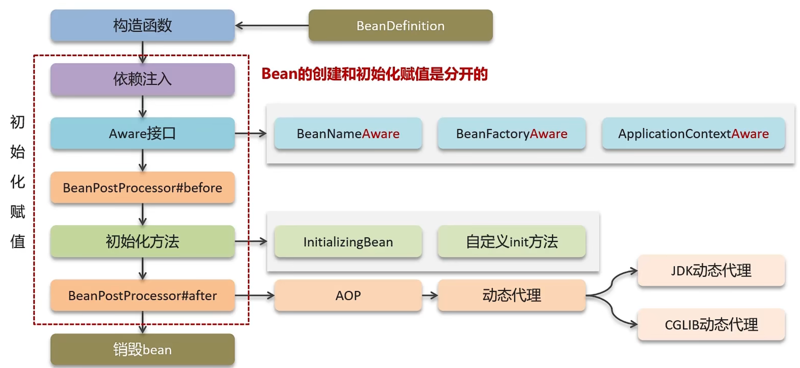
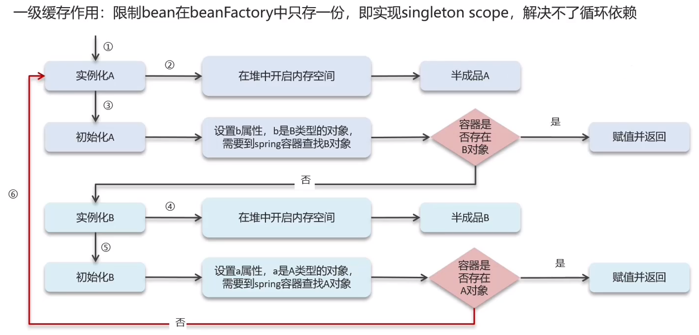
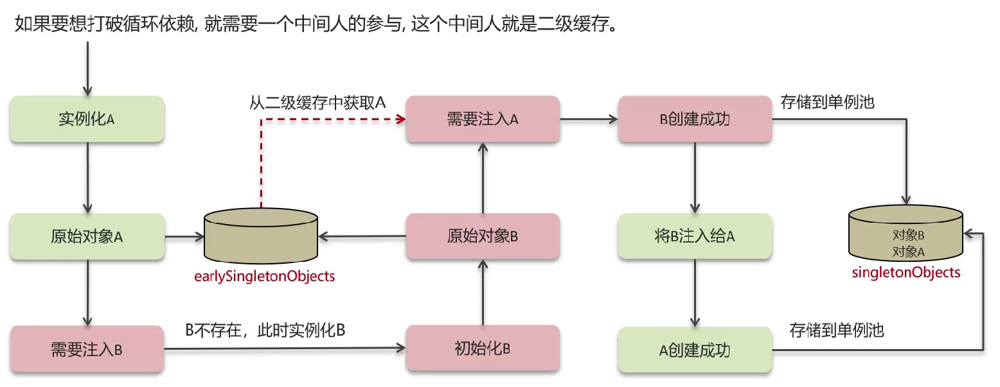
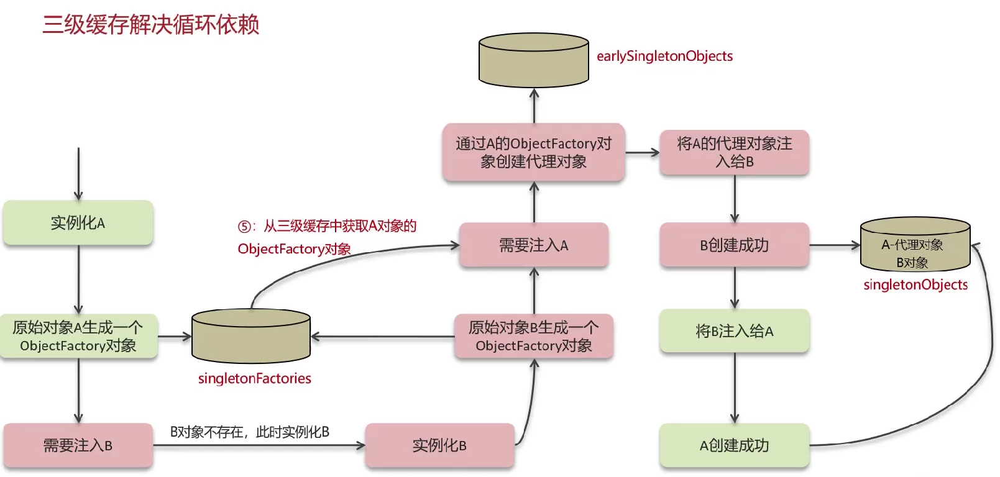
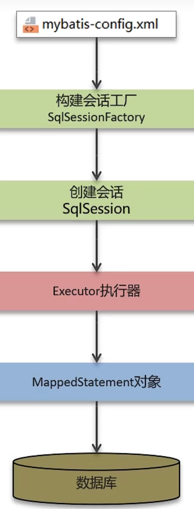

# SSM相关面试题


# 一、SpringMVC

## 1. SpringMVC的拦截器和servlet的过滤器的区别

>   *   过滤器filter是Javaweb的三大组件之一，依赖于servlet容器，在实现上基于函数回调，可以对绝大部分请求进行过滤
>   *   拦截器是Spring提供的，在实现上基于Java的反射机制，是面向切面编程的一种应用
>   *   如果两个都存在，过滤器是在拦截器的外层的，也就是说过滤器会先执行
>   *   过滤器只在servlet前后起作用，而拦截器能够深入到方法前后、异常抛出前后等位置，因此拦截器的使用具有更大的弹性，所有在Spring架构的程序中推荐优先使用拦截器


## 2. SpringMVC的执行流程

>   **视图阶段**
>
>   
>
>   1.   首先请求发出后，在后台就会有一个由tomcat初始化的前端控制器DispatcherServlet来接收这个请求
>        *   前端控制器DispatcherServlet相当于一个调度中心，它内部有很多的组件类，例如：
>            *   处理器映射器HandlerMapping
>            *   处理器适配器HandlerAdaptor
>            *   视图解析器ViewResolver
>   2.   请求到达前端控制器后，它发送给处理器映射器查询handler
>        *   我们的controller层中有很多的方法，方法上会有`@RequestMapping`注解来标识请求路径，在处理器映射器中就有一个map来保存请求路径与这些方法的关系
>   3.   在处理器映射器查询完后，会返回一个处理器执行链HandlerExecutionChain给前端控制器
>        *   因为我们执行这个方法可能还会有拦截器等方法需要执行，因此返回的处理器执行链中包含有整个的执行流程
>   4.   前端控制器会根据处理器执行链，向处理器适配器请求执行方法
>   5.   处理器适配器就会调用方法进行执行
>   6.   方法执行完后会返回响应给处理器适配器
>        *   方法中的参数是从前端接收到的，而且请求也可以是多种多样，这时候处理器适配器的作用就体现出来了，它能够将请求的参数进行处理并赋值给方法的形参，并且将方法的返回值进行处理
>   7.   处理器适配器执行完后会返回ModelAndView给前端控制器
>   8.   前端控制器会找视图解析器将逻辑视图解析为真正的视图
>   9.   视图解析器会返回View对象
>   10.   前端控制器得到视图对象后就会渲染视图并返回响应
>
>   
>
>   **前后端分离阶段**
>
>   
>
>   1.   前5步与视图阶段一模一样
>
>   2.   我们如果加上了`@ResponseBody`注解，那么前端控制器就会通过HttpMessageConverter来将返回结果转换为JSON并响应给前端


## 3. SpringMVC如何处理异常

>   我们可以配置全局异常处理器来对控制层的异常进行统一处理，需要使用到两个注解：
>
>   *   `@ControllerAdvice`：在类上打上这个注解，标明这个类是控制增强器，用于给Controller层添加统一的操作
>   *   `@ExceptionHandler`：我们可以在方法上打上这个注解，用于标识捕获的异常种类，这个时候我们就可以自定义对异常的处理


# 二、Spring

## 1. 什么是IOC，什么是DI

>   *   IOC官方称之为控制反转，用人话说就是我们把创建对象的权力交由Spring管理，Spring通过工厂模式创建出对象并存入Spring的容器中，官方称这个对象为bean，当我们要使用这个对象时就可以直接从Spring容器中获取。优势是创建对象的解耦。
>   *   DI官方称之为依赖注入，说白了就是从Spring容器中获取bean对象并将其赋值给我们自己定义的变量，这个注入是自动注入，需要调用JavaBean对象的set方法或者有参构造器来赋值。优势就是使用对象时解耦。


## 2. 依赖注入的方式

>   1.   使用JavaBean对象的set方法注入
>   2.   使用有参构造器注入，比较推荐的方法是在需要注入的类上打上`@RequiredArgsConstructor`注解，并在需要注入的实例前加上`final`修饰


## 3. @Autowired和@Resource的区别

>   *   `@Autowired`：由Spring提供的注解，默认通过类型注入，如果存在多个相同的类，则需要通过`@Qualifier`注解来指定类的名称
>   *   `@Resource`：由Java提供的注解，默认优先通过名称注入，然后再通过类型注入，如果存在多个相同的类型，则必须指定名称


## 4. Spring支持几种bean的作用域

>   Spring框架支持五种bean的作用域：
>
>   1.   singleton：bean在每个SpringIOC容器中只有一个实例，其实就是单例模式，每个实例默认为单例模式
>   2.   prototype：一个bean的在SpringIOC容器中可以有多个实例，即多例模式
>   3.   request：每次http请求都会创建一个bean，该作用域仅在基于web的SpringApplicationContext下有效
>   4.   session：在一个http会话中，一个bean对应一个实例，该作用域仅在基于web的SpringApplicationContext下有效
>   5.   application：属于应用程序域，应用程序启动时bean创建，应用程序销毁时bean销毁，该作用域仅在基于web的ServletContext下有效


## 5. Spring框架中的单例bean是线程安全的吗？

>   Spring框架中的单例bean是线程不安全的，因为它会被所有的线程共享，如果bean中有实例变量，那么这些实例变量就可能成为多线程访问的共享资源，从而导致线程安全问题。 
>
>   如果要想使bean线程安全，最简单的办法就是使其多例化，即设置作用域为`prototype`。此外，我们还可以使用`ThreadLocal`，因为它是线程隔离的，我们可以将状态信息存储在每个线程的上下文中。或者我们可以将它设置在方法中，这样也能避免线程安全问题。然后还有一种方法就是加锁，或者使用同步代码块或同步方法。


## 6. Spring自动装配bean有哪些方式？（xml开发方式）

>   常用的有四种：
>
>   1.   第一种是通过名称，如果一个接口有多种实现，这时就需要指定名称来装配
>   2.   第二种是通过类型，根据类型自动匹配注入
>   3.   第三种是通过构造器，与通过类型自动装配类似，它是通过构造器的参数进行注入
>   4.   第四种是默认方式，它不是默认的方式，而是单纯叫做默认方式default，这个模式会自动探测使用构造器自动装配或者通过类型自动装配
>
>   如果你不配置，那么spring默认不会自动装配，就需要自行在bean定义中用标签设置依赖关系。


## 7. Spring有哪些重要的注解

>   *   关于bean的注解
>       *   最基本的`@Component`，在spring执行时将该类创建并放入spring容器中
>           *   `@Controller`用于控制层
>               *   我们一般使用`@RestController`，它是`@ResponseBody`和`@Controller`的整合注解
>           *   `@Service`用于业务层
>           *   `@Repository`用于数据交互层
>               *   值得一提的是dao层我们一般使用mybatis提供的`@mapper`注解
>       *   用于标明配置类的`@Configuration`
>       *   用于设定扫描路径的`@ComponentScan`
>       *   `@PropertySource`加载properties文件
>       *   需要将第三方的类放入spring容器管理时需要使用`@Bean`注解
>       *   用于设置bean的作用域`@Scope("singleton")`，默认为单例，还可以设置为多例、request、session、globalSession
>       *   关于bean生命周期的注解，`@PostConstruct`为init方法，`@PreDestroy`为destroy方法
>       *   `@Autowired`开启依赖注入时自动装配，默认按类型自动装配，如果有多个相同类型则需要使用`@Qualifier`指定名称
>       *   `@Value`实现简单类型注入
>   *   关于aop的注解
>       *   `@EnableAspectJAutoProxy`用于开启aop
>       *   `@Aspect`用于将该类作为切面类并交由spring容器管理
>       *   `@Pointcut`定义切入点
>       *   五个增强方法：`@Before`前置增强、`@AfterReturning`后置增强、`@AfterThrowing`异常抛出增强、`@After`最终增强、`@Around`环绕增强
>       *   `@EnableTransactionManagement`用于开启事务管理
>       *   `@Transactional`用于在类或方法上标识开启事务
>       *   `@EnableWebMvc`用于开启SpringMVC多项辅助功能
>       *   `@RequestMapping`用于在类或方法上标识访问路径，我们如果使用Restful风格编程就可以使用它的拓展注解：
>           *   `@GetMapping`
>           *   `@PostMapping`
>           *   `@PutMapping`
>           *   `@DeleteMapping`
>       *   `@RequestParam`将请求参数赋值给形参
>       *   `@PathValiable`将路径参数赋值给形参
>       *   `@RequestBody`将请求的json字符串封装到对象中
>       *   `@DateTimeFormat`将请求参数解析为时间格式
>       *   `@ExceptionHandler`用于设置全局异常处理器
>   *   关于Spring的注解还有好多好多，背不完，根本背不完


## 8. Spring中的事务是如何实现的

>   *   第一种方法是编程式事务控制，需要使用TransactionTemplate来实现，这种方法对业务代码有侵入性，会造成高耦合，不过它可以更小粒度地控制事务的范围
>   *   第二种方法是使用声明式事务管理，通过`@Transactional`注解来开启事务。它的本质是通过aop，从ThreadLocal中获取与数据库的连接，在方法执行前将事务自动提交功能关闭，在方法结束后根据执行的成败从而进行提交或回滚


## 9. Spring中事务失效的场景

>   1.   因为Spring事务是基于动态代理来实现的，所有只有被代理对象调用时，那么这个注解才会生效
>   2.   如果这个方法是私有化或是被final修饰的，那么@Transactional也会失效，因为底层cglib是基于父子类来实现的，子类是不能重写父类的私有化方法的，而且final修饰的方法不能再被重写
>   3.   在业务中对异常进行了捕获，Spring框架无法感知到异常也会使@Transactional失效
>   4.   @Transactional默认只捕获运行时异常，不过我们可以配置Rollback的值为Exception.class来捕获所有的异常


## 10. Spring的事务传播行为

>   *   REQUIRED：需要有。当前如果有事务则加入事务，如果没有事务则创建新事务，是spring事务传播的默认值，大部分情况下都是用该事务传播行为
>   *   REQUIRES_NEW：需要有新的。无论当前有没有事务都会创建新的事务，当我们不希望事务之间相互影响的时候就可以使用该传播行为。例如记录日志，无论操作是否成功都需要记录日志
>   *   SUPPORTS：支持。当前有事务就加入事务，没有事务就以无事务状态正常执行
>   *   NOT_SUPPORTED：不支持。只在无事务状态下执行，如果当前有事务则挂起当前事务
>   *   MANDATORY：必须有。如果当前有事务则加入事务，没有则抛出异常
>   *   NEVER：必须没有。如果当前有事务则抛出异常
>   *   NESTED：嵌套的。如果当前存在事务，则在嵌套事务内执行，如果当前没有事务则创建新事务


## 11. 谈谈你对spring的理解（IOC、AOP）

>在这个Spring家族中，我们最常用的就是spring框架，在spring框架中有两个非常重要的组件，一个是IOC，一个是AOP。
>
>IOC组件中又有控制反转模块和依赖注入模块，控制反转就是把我们创建对象的权力交由spring管理，spring使用工厂模式创建出bean对象存入spring IOC容器中，它的优势是能够在创建对象层面进行解耦，我们不需要关注它是怎么创建出这个对象的，只需要从IOC容器中获取对象使用即可。而依赖注入就是从IOC容器中获取bean对象并将其赋值给我们自己定义的变量，这个注入是自动注入，需要调用Java Bean对象的set方法或者有参构造器来进行赋值，它的优势是能够在使用对象层面进行解耦。
>
>AOP是面向切面编程，是面向对象编程的一种补充，底层实现其实是基于动态代理的，它的思想就是将需要增强的方法做为切入点，我们准备切面用于插入切入点，切面中包含切面表达式和通知，切面表达式用于描述需要将通知插入到哪些切入点中，通知就是增强的方法，最常用的就是环绕增强，然后还有前置增强、后置增强、异常抛出增强和最终增强。AOP能够将那些与业务无关却需要使用的逻辑封装起来，例如事务与日志的处理，它能够减少重复代码并且降低耦合度，也有利于代码的拓展和维护。


## 12. JDK动态代理和CGLIB动态代理的区别

>   JDK动态代理和CGLIT是两种常见的动态代理技术
>
>   *   JDK动态代理是面向接口的代理模式，Spring通过Java的反射机制生成被代理接口的匿名实现类，重写了其中AOP的增强方法。（兄弟代理，代理对象与目标对象是兄弟关系）
>   *   CGLIB是针对类来实现代理，通过修改被代理对象类的字节码文件生成子类来覆盖其中的方法进行增强，但因为采用的是继承，所以类和方法不宜使用final修饰和私有化。（认爹代理，目标对象与代理对象是父子关系）
>   *   如果要被代理的对象是个实现类，那么Spring会使用JDK动态代理来完成操作；如果要被代理的对象不是个实现类那么，Spring会强制使用CGLib来实现动态代理
>   *   可以在spring项目中使用`@EnableAspectJAutoProxy(proxyTargetClass = true)`来强制使用CGLIB动态代理


## 13. spring的bean的生命周期



>   1.   Spring容器在进行实例化的时候，会将applicationContext.xml文件中，在bean标签中配置的信息封装成一个BeanDefinition对象，当然我们用注解也可以进行配置。这个对象中包含bean的id、bean的类型、bean的值、bean的作用域、是否延迟初始化等等一些信息，Spring就是根据这个对象来创建bean对象
>   2.   在获取BeanDefinition对象之后，就会调用bean的构造函数来实例化当前bean对象
>   3.   在获取实例化对象后就会进行依赖注入
>   4.   完成依赖注入后如果我们实现了Aware接口就会调用它，比较常见的有BeanNameAware、BeanFactoryAware、ApplicationContextAware
>        *   BeanNameAware：获取bean的名称
>        *   BeanFactoryAware：获取bean工厂
>        *   ApplicationContextAware：获取容器上下文对象
>   5.   接下来就到了bean的后置处理器——BeanPostProcessor，这里首先会在初始化方法前调用该接口的预初始化方法，完成后再进行初始化操作，在初始化操作结束后再进行调用该接口的后初始化方法，然后bean就可以被应用程序使用了。值得一提的是，Spring的AOP就是通过这个后置处理器来实现的
>   6.   关于初始化方法又分为两个，一个是initializingbean，如果我们实现了这个接口就会调用这个接口进行bean的初始化操作；第二个是自定义的初始化方法，例如我们使用`@PostConstruct`注解定义的方法，或者在applicationContext.xml中通过init_method配置的方法
>   7.   bean的创建到这里就结束了。在完成初始化后，根据bean的作用域，如果是singleton，就将这个bean存入spring的IOC容器中；如果是prototype，就将这个bean交给调用者，由调用者管理这个bean的生命周期
>   8.   当容器关闭或者bean不再需要时，单例模式时Spring会调用自定义的销毁方法来进行清理工作和释放资源，而多例模式不会进行销毁工作，它的销毁由调用者管理


## 14. spring中的循环引用

[视频讲解](./img/Spring-bean的循环依赖（循环引用）.mp4)

>   循环引用也称为循环依赖，就是两个或则两个以上的bean互相持有对方，最终形成闭环。简单的来说就是A依赖B的同时，B依赖A。在创建A对象的同时需要使用的B对象，在创建B对象的同时需要使用到A对象。在spring中通过三级缓存的机制帮助我们解决了大部分循环依赖的问题。
>
>   *   一级缓存singletonObjects：单例池，缓存已经经历了完整的生命周期，已经初始化完成的bean对象
>   *   二级缓存earlySingletonObjects：缓存早期的bean对象，即这个bean的生命周期还没走完，是个半成品
>   *   三级缓存singletonFactories：缓存ObjectFactory对象工厂，用来创建某个对象，可以是原始对象，也可以是代理对象
>
>   **一级缓存**
>
>   
>
>   **二级缓存**
>
>   
>
>   如果对象A是代理对象，那么只靠一级和二级缓存是不能够解决循环依赖问题的，存入单例池中的并不是代理对象。因此一级和二级缓存只能解决一般对象的循环依赖问题，代理对象的循环依赖问题需要借助到三级缓存。
>
>   **三级缓存**
>
>   
>
>   三级缓存的方式能够解决大部分的循环依赖问题，但是它处理不了构造方法循环依赖的问题，这就需要我们手动在产生循环依赖的构造方法形参列表中添加一个`@Lazy`注解，将传参对象设置为懒加载，这样就能够解决构造方法产生的循环依赖问题。
>
>   那么如果只有一级和三级缓存可以吗？答案是不可以的。
>
>   *   多例问题：如果没有二级缓存，我们需要注入对象就需要从三级缓存创建新的对象拿来注入，这样看起来没问题，但每次需要注入都需要创建新的对象，会产生多例的情况，IOC中有多个实例对象我们是无法解决的
>   *   单一职责问题：三级缓存的作用就是只用来创建对象的，二级缓存是用来存储半成品的bean，我们需要注入bean应该从二级缓存中获取
>   *   优化效率问题：我们后续如果需要注入对象时，就可以直接从二级缓存中获取，而不需要再次从三级缓存中创建对象


# 三、Mybatis

## 1. mybatis的#{}和${}的区别

>   *   `#{}`是预编译处理，将sql语句进行预编译时会将这里面的内容替换为“?”，然后调用PreparedStatement的set方法来进行赋值，并且会加上引号，可以很大程度防止sql注入
>   *   `${}`是字符串替换，你给的是什么值转换的就是什么值


## 2. mybatis的执行流程

>   
>
>   1.   读取mybatis的配置文件，加载运行环境和映射文件
>   2.   创建会话工厂SqlSessionFactory，全局只有一个，用于生产SqlSession
>   3.   通过会话工厂创建SqlSession对象，里面包含了执行SQL语句的所有方法
>   4.   从SqlSession中获取Executor执行器，里面封装了JDBC的操作，是真正操作数据库的接口，同时维护缓存
>   5.   Executor读取MappedStatement对象，然后对输入参数进行映射，再执行sql语句，最后将输出结果映射并返回
>        *   一个MappedStatement对象代表一个标签，里面封装了映射信息


## 3. mybatis如何获取生成的主键

>   如果数据表使用的是自增主键的话，我们可以在`insert`标签中配置`useGeneratedKeys`和`keyProperty`两个属性来获取数据库生成的主键。
>
>   *   `useGeneratedKeys`：默认值为`false`，当我们设置为`true`是时就会使用JDBC的getGenereatedKeys方法获取主键并赋值到`keyProperty`设置的领域模型属性中
>   *   `keyProperty`：默认值`unset`，用于设置getGeneratedKeys方法的返回值将赋值到领域模型的哪个属性中
>
>   此外，如果我们是通过注解写sql语句的话，那么可以在方法上加上`@Options`注解，它里面也有`useGeneratedKeys`、`keyProperty`这两个属性。


## 4. 当实体类中的属性名和表中的字段名不一样怎么办

>   1.   可以开启mybatis驼峰命名自动匹配映射，可以解决一部分的字段名不匹配问题
>   2.   设置字段的别名，使其与实体类属性名保持一致
>   3.   通过ResultMap来映射字段名和实体类属性名一一对应


## 5. mybatis如何实现多表查询

**ResultMap编写方式**

```xml
<resultMap id="唯一标识" type="映射的entity对象的绝对路径">
    <id column="表主键字段" jdbcType="字段类型" property="映射entity对象的主键属性" />
 
    <result column="表某个字段" jdbcType="字段类型" property="映射entity对象的某个属性"/>
 
    <!-- 指的是entity对象中的对象属性 -->
    <association property="entity中某个对象属性" javaType="这个对象的绝对路径">
        <id column="这个对象属性对应的表的主键字段" jdbcType="字段类型" property="这个对象属性内的主键属性"/>
        <result column="表某个字段" jdbcType="字段类型" property="这个对象属性内的某个属性"/>
    </association>
 
    <!-- 指的是entity对象中的集合属性 -->
    <collection property="entity中的某个集合属性" ofType="这个集合泛型所存实体类的绝对路径">
        <id column="这个集合属性中泛型所存实体类对象对应表的主键字段" jdbcType="字段类型"
            property="这个集合属性中泛型所存实体类对象的主键属性"
        />
        <result column="表某个字段" jdbcType="字段类型" 
                property="这个集合属性泛型所存实体类对象的属性"
        />  
    </collection>
 
    <!-- 引用另一个resultMap (套娃) -->
    <collection property="entity中的某个集合属性" 
                resultMap="这个引用的resultMap的type,就是这个集合属性泛型所存实体类的绝对路径"
    />
</resultMap>
```

>   1.   直接编写多表关联查询的sql语句，使用ResultMap建立结果集映射，其中`association`<sub>/əˌsoʊsiˈeɪʃn/</sub>标签用于配置实体类中普通属性的映射关系，`collection`标签用于配置实体类中集合属性或另一实体类的映射关系
>   2.   直接拆分为多个单表查询


## 6. mybatis有哪些动态sql

>   mybatis提供了9种动态sql标签，可以动态的根据属性值来拼接数据库执行的sql语句：
>
>   *   \<if\>：根据`test`属性中的条件判断是否展示sql
>   *   \<where\>：动态拼接where字段，可以去除sql前多余的and
>   *   \<set\>：动态拼接set字段，可以去除sql后多余的“,”
>   *   \<foreach\>：把传入的集合对象进行遍历
>   *   \<include\>：用于抽取sql，减少重复sql的书写
>   *   \<trim\>：是一个格式化标签，用于处理字符串
>   *   \<choose\>\<when\>\<otherwise\>：这是一组组合标签，类似Java中的switch、case、default


## 7. mybatis是否支持延迟加载

>   mybatis仅支持`association`和`collection`的延迟加载，可以通过设置lazyLoadingEnabled的值为true来开启全局的延迟加载，然后也可以在ResultMap映射时，它里面的`association`和`collection`标签中有一个`fetch`属性，可以设置它来开启局部的延迟加载。


## 8. mybatis延迟加载的原理

>   使用CGLIB创建目标对象的代理对象，调用目标方法时会进入拦截器方法，如果发现目标对象的某个属性值为空，那么就会单独发送事先保存好的sql语句去查询，并将查询出来的结果进行赋值


## 9. mybatis如何实现批量插入数据

>   1.   mybatis的接口方法参数需要定义为集合类型
>   2.   在映射文件中通过\<forEach\>标签遍历集合，这个标签中有这些属性：
>        *   collection：形参的名称
>        *   index：从集合中取出元素的位置，list就是索引，map就是key
>        *   item：从集合中取出元素的名称
>        *   separator：分隔符
>        *   open：开始符号
>        *   close：结束符号


## 10. mybatis的一级、二级缓存

>   mybatis支持一级缓存和二级缓存，这些缓存都是保存在本地缓存中，它的实现是基于PerpetualCache类，本质就是一个HashMap。一级缓存的作用域是session级别，这个session主要指的是sqlSession，范围相对来说比较小；二级缓存的范围相对就大一些，它的作用域是namespace命名空间和mapper的作用域，不依赖于session。两个缓存的区别主要体现在不同作用域下，保存缓存的时机是不同的。
>
>   *   一级缓存：默认开启，在同一个session中执行多次相同的sql，只会在数据库中进行一次查询，当session执行flush或close时会清空缓存。
>   *   二级缓存：默认关闭，当我们希望在命名空间和mapper中执行多次相同的sql却只在数据库中进行一次查询，我们就可以开启二级缓存。需要在全局配置文件中将cacheEnable的值设置为true，然后使用`<cache \>`标签让当前的mapper生效即可。需要注意的时，二级缓存中的数据需要实现Serializable序列化接口，并且只有当会话提交或关闭后，一级缓存中的数据才会存入二级缓存中
>
>   当我们执行增删改操作时，会将该作用域下所有的缓存都清除。


# 四、SpringBoot

## 1. SpringBoot自动装配原理

>   我们在SpringBoot项目的启动类上会打上`@SpringBootApplication`注解，其实SpringBoot的自动装配主要依赖的也就是这个注解。`@SpringBootApplication`注解中整合了三个注解：
>
>   *   `@SpringBootConfiguration`：作用与`@Configuration`注解相同，用来声明当前类是一个配置类
>   *   `@ComponentScan`：组件扫描注解，默认扫描当前类所在的包及其子包
>   *   `@EnableAutoConfiguration`：SpringBoot实现自动化配置的核心注解
>
>   `@EnableAutoConfiguration`注解中又整合了很多注解，其中有一个`@Import`注解用于导入自动配置的选择器，它会读取该项目和该项目引用的Jar包的classpath路径下META-INF中的一个spring.factories文件，这个文件中存储了很多配置类的全限定类名，SpringBoot会根据一些条件去指定加载这些类：
>
>   *   配置类的类上有一个`@ConditionalOnClass`注解，这个注解会判断是否有对应的字节码文件，当我们导入了相关的依赖其实就有了，这时才能进入类运行其中的方法
>   *   方法上有`@Bean`和`@ConditionalOnMissingBean`注解，这个注解会判断当前的Spring IOC容器中有没有对应的bean，如果存在则不会执行这个方法

 

## 2. SpringBoot启动流程

>   1.   首先会进入启动类中的`SpringApplication.run(启动类.class, args)`方法，它会在执行run()方法前new一个SpringApplication对象。
>   2.   然后进入run()方法，它会调用SpringBoot的各个初始化器进行初始化和准备工作。
>   3.   在这之后，SpringBoot会创建应用程序的上下文，在这个阶段会执行SpringBoot自动装配的机制。
>   4.   SpringBoot会执行各种启动任务，包括创建Web服务器、加载应用程序的配置、初始化各种组件等。这个阶段会执行SpringBoot的刷新机制，它会调用各种初始化器和监听器，执行各种启动任务。其中启动Tomcat 就是在这个环节进行。


## 3. SpringBoot常用的起步依赖有哪些

>   *   `spring-boot-starter-web`
>   *   `spring-boot-starter-test`
>   *   `spring-boot-starter-jdbc`
>   *   `mybatis-spring-boot-starter`
>   *   `mybatis-plus-spring-boot-starter`
>   *   `spring-boot-starter-data-redis`
>   *   `spring-boot-starter-amqp`
>   *   `spring-boot-starter-data-elasticsearch`
>   *   `spring-boot-starter-data-mongodb`
>   *   `spring-cloud-starter-alibaba-nacos-discovery`
>   *   `spring-cloud-starter-openfeign`


## 4. SpringBoot支持的配置文件有哪些

>   按执行顺序排序：
>
>   *   bootstrap.yml
>   *   application.yaml
>   *   application.yml
>   *   application.properties
>   *   设置全局的JVM参数：-D键=值
>       *   举例：-Dserver.port=8080
>   *   设置启动参数：--键=值
>       *   举例：--server.port=8080

