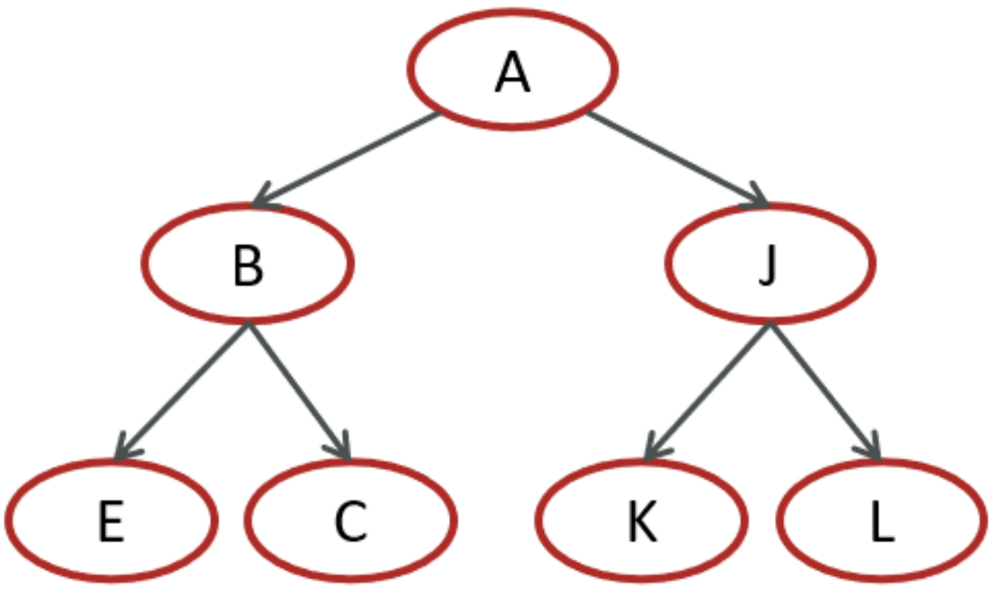
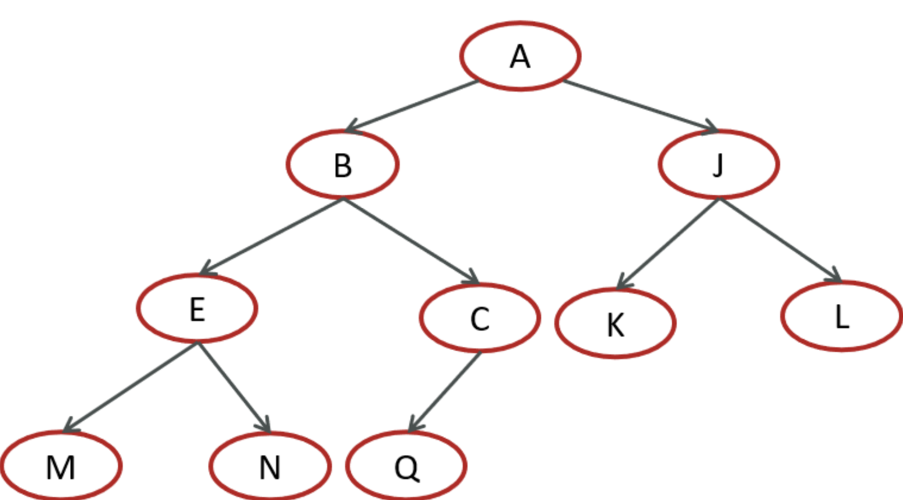
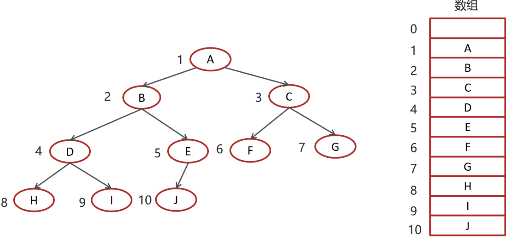
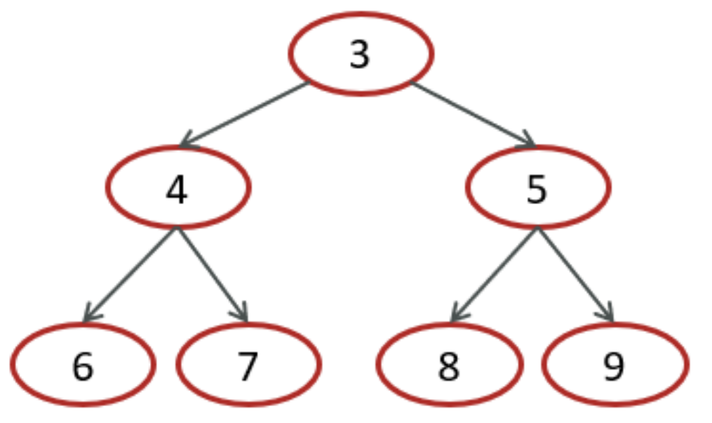
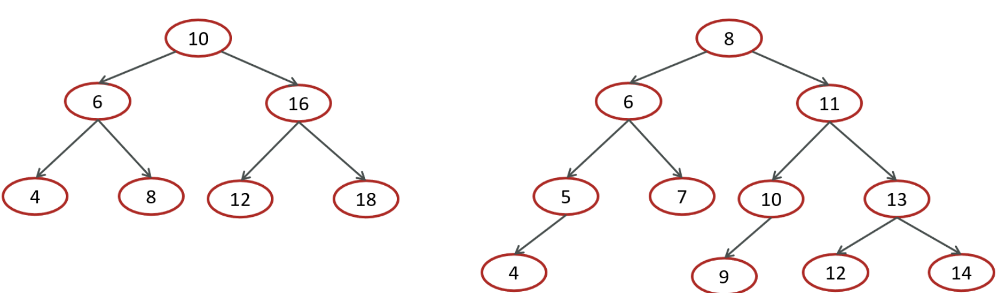
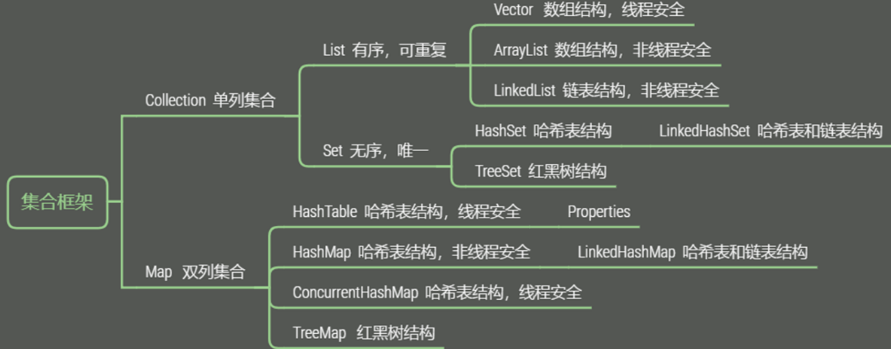
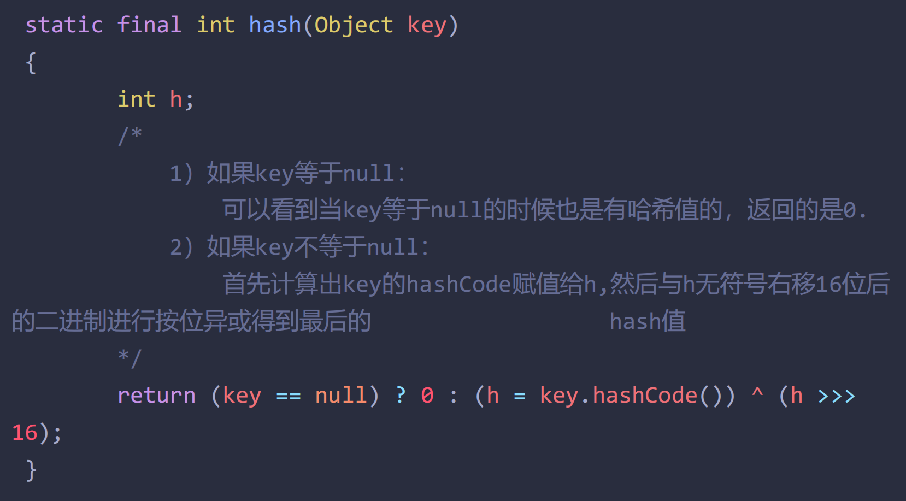
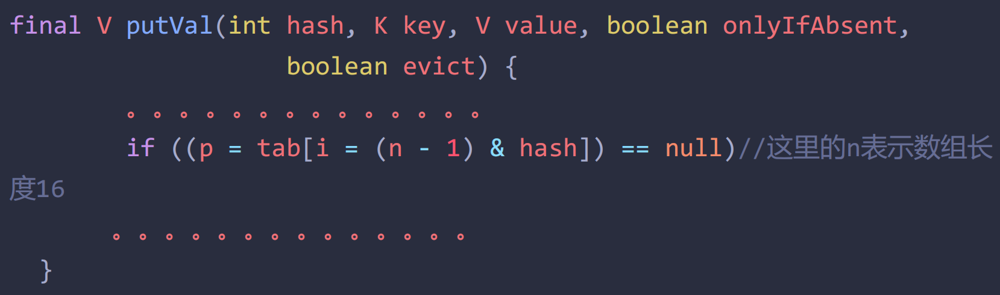

# 集合面试题

# 1. 数组

1.   什么是数组？

>   一种用连续的内存空间存储相同数据类型的数据结构，通过索引来获取数组中的元素，索引从0开始，最后一个位置的索引为数组的长度减一

2.   操作平台如何根据索引获取对应元素的内存地址？

>   拿int类型的数组举例，数组在内存中是连续存储的，JVM的栈中用一个变量存储数组的地址，由于int类型的数据大小占4个字节，因此索引为0的元素在内存中的地址从数组地址加0乘4个字节开始，到再往后推3个字节结束，索引为1就是从1×4+地址开始，到再往后推3个字节结束
>
>   **寻址公式：**
>
>   `a[i] = baseAddress + i * dataTypeSize`
>
>   baseAddress代表数组地址，i代表索引，dataTypeSize代表数组中元素类型的大小

3.   数组增、删、改、查的时间复杂度

>   1.   数组通过索引查询，根据地址和寻址公式可以很快地找到元素，时间复杂度是O(1)
>   2.   由于数组是一段连续的内存空间，进行增、删会影响后面的所有元素，时间复杂度是O(n)

# 2. 链表

1.   什么是链表

>   链表是一种非线性的数据结构，其中的每个元素称为结点，各结点间用指针连接起来。每个结点包含两个部分，一个是实际存储的元素，另一个是一个指针，用于指向下一个结点。

2.   单向链表、双向链表、循环链表、双向循环链表

>   1.   单链表是最基本的链表结构，结点中存储两个数据，一个是实际存储的元素，一个是指向下一个结点的指针
>   2.   双链表的结点中一共存储三个元素，除实际存储的数据外还有两个指针，一个指向上一个结点，一个指向下一个结点，因此给定一个结点，你既可以访问上一个结点的数据，也可以访问下一个结点的数据
>   3.   循环链表是单链表的进阶版，它的尾结点的指针会指向头结点的地址，因此实现循环
>   4.   双向循环链表是双链表的进阶版，它的头节点的上一个指针指向尾结点，尾结点的下一个指针指向头结点

3.   链表增、删、查的时间复杂度

>   1.   链表新增结点只需将新增结点指向下一个结点，再将上一个结点的指针指向它自己即可，时间复杂度是O(1)
>   2.   链表删除结点只需将待删除结点的上一个节点的指针指向待删除结点的下一个结点即可，时间复杂度是O(1)
>   3.   链表的查询需要从给定结点一次遍历判断，直到找到查询的结点，查询的时间复杂度是O(n)

4.   栈和队列

>   一句话概括：栈先进后出，队列先进先出

# 3. 哈希表

1.   什么是哈希表

>   哈希表是一种根据键访问值的数据结构，它是由数组演变而来，根据数组通过索引访问数据的思想，将键进行哈希计算后得到的值作为索引访问数组中的值

2.   散列函数与散列冲突

>   将键进行哈希计算的函数称为散列函数，需要满足三个要求：
>
>   1.   计算后的值必须大于等于0
>   2.   键相同，哈希值一定相同
>   3.   键不同，哈希值一定不同
>
>   实际上，第1、2点必须实现，但第3点不可能实现，当有多个不同的键计算出的哈希值相同时，这种情况便称为散列冲突

3.   解释一下哈希冲突的链表法

>   在哈希表中，数组中的每个位置我们可以称之为桶或槽，每个槽中对应一条链表，所有哈希值相同的元素将存储到相同槽位的对应链表中。这样设计的哈希表进行插入操作时的时间复杂度为O(1)，进行查找与删除时的平均时间复杂度为O(1)，但如果散列函数设计得不好，则会导致散列冲突发生概率升高，这将会使时间复杂度急剧升高为O(n)。不过我们可以选择优化哈希表，将链表改造为如跳表、红黑树这类高效的动态数据结构，这样查询的时间复杂度为O(log(n))

# 4. 二叉树

1.   满二叉树与完全二叉树

>   满二叉树
>
>   
>
>   1.   叶子节点全部都在最底层
>   2.   除叶子节点，每个节点都有左右两个子节点
>
>   
>
>   完全二叉树
>
>   
>
>   1.   叶子节点在最底下两层
>   1.   除最后一层，其它层的节点数要达到最大
>   1.   最后一层的叶子节点靠左排序

2.   完全二叉树的数据结构

>   
>
>   完全二叉树采用数组存储数据，当一个节点在数组的下标为k，则它的左子节点下标为2k，右子节点下标为2k+1。采用数组存储完全二叉树能够有效利用存储空间。

3.   二叉树遍历

>   
>
>   *   前序遍历：节点 -> 左 -> 右：3467589
>   *   中序遍历：左 -> 节点 -> 右：6473859
>   *   后序遍历：左 -> 右 -> 节点：6748953

4.   二叉搜索树

>   
>
>   1.   树中的任一节点的值，比其左节点大，比其右节点小
>   2.   任一节点的左、右子树也分别为二叉搜索树
>   3.   没有键值相等的节点

5.   红黑树的特质

>   1.   节点要么是红色，要么是黑色
>   2.   根节点是黑色
>   3.   叶子节点都是黑色的空节点
>   4.   红黑树中红色节点的子节点都是黑色
>   5.   从任一节点到叶子节点的所有路径都包含相同数目的黑色节点

# 5. 集合

1.   Collection和Map的集合分类

>   
>
>   *   Collection接口的子接口包括Set接口和List接口
>       *   List接口的实现类主要有ArrayList、LinkedList、Stack、Vector等
>           *   Stack是Java的栈实现，继承Vector类，性能不好，官方都不推荐用它
>           *   Vector相对来说是线程安全的，但不是绝对的，会有例外情况
>       *   Set接口的实现类主要有HashSet、LinkedHashSet、TreeSet等
>   *   Map接口的实现类有HashMap、LinkedHashMap、TreeMap、HashTable、ConcurrentHashMap、Properties等
>       *   HashTable是并发安全的Map，但是性能差
>       *   ConcurrentHashMap是并发安全的Map，性能较好

2.   数组和List的转换

>   *   数组 -> List：使用Arrays工具类的asList方法
>   *   List -> 数组：使用List的toArray方法，如果不传参则生成Object数组，传入参数对象并已初始化长度则返回该数组对象

3.   List、Set、Map

>   *   List存储的数据的特点是有序、可重复、有索引，常用的实现类有ArrayList、LinkedList。ArrayList底层是动态数组，创建时数组的默认长度为0，添加第一个元素时长度会扩容为10，每次存满时长度会扩容1.5倍，如果一次添加多个元素扩容1.5倍还存不下，则会直接扩容到所需长度，是一种查询快、增删满的数据结构。LinkedList底层是双链表，是一种头尾增删快、查询较慢的数据结构。
>   *   Set中存储的数据的特点是无序、不可重复、无索引，常用的实现类有HashSet、LinkedHashSet、TreeSet。HashSet的底层是哈希表，在JDK8前是以数组+链表的方式实现的，在JDK8开始是以数组+链表+红黑树实现的。HashSet依靠hashcode和equals确定在数组中的位置，在新创建时数组的默认长度为16，默认的加载因子是0.75，当数组中的元素超过了数组长度与加载因子的乘积就会扩容两倍，当链表长度超过了8且数组的长度不少于64时，链表就会转换为红黑树，当红黑树的节点不大于6时又会退化为链表。LinkedHashSet底层就是比HashSet多了个双链表，因此实现了有序。而TreeSet的底层是红黑树，依靠比较来实现去重和排序。
>   *   Map的特点就是键唯一，对值不做要求。常用的实现类有HashMap、LinkedHashMap、TreeMap，这些类的底层与对应的Set集合的实现类基本类似。

4.   HashMap的put()执行流程

>   1.   判断容器是否为空，是则扩容
>   2.   将key通过hashcode方法进行计算得到插入数组的索引
>   3.   找到数组中索引的位置，如果为空则直接插入
>   4.   如果不为空，如果是链表结构则会遍历链表并通过equals方法判断是否相同，相同则覆盖
>   5.   如果都不相同，则进行插入，在插入后判断链表长度是否大于8且数组长度不少于64，如果是就会将链表转化为红黑树
>   6.   如果在插入元素时数组不为空且数据结构是红黑树，则直接插入，至于实现的是插入还是替换就交由红黑树判断
>   7.   最后在执行完插入操作后，会判断数组中的元素个数是否超过了数组长度与加载因子的乘积，如果是则扩容

5.   hashmap的数组索引计算公式

>   `index = (数组长度 - 1) & 哈希值`
>
>   
>
>   `哈希值 = (key == null) ? 0 : (key.hashCode()) ^ (h >> 16)`
>
>   
>
>   为什么要异或右移16位的结果？
>
>   使高位的特征也参与到运算，以这种方式来减少哈希冲突

6.   为什么HashMap的数组长度一定是2的幂次方？

>   1.   计算索引时效率更高，如果是2的幂次方可以使用位与运算代替取模
>   2.   扩容时重新计算索引效率更高：hash & oldCap == 0的元素留在原来位置，否则新位置 = 旧位置 + oldCap

7.   HashMap在1.7情况下的多线程死循环问题

>   *   JDK1.7时HashMap是头插法，多线程时可能会造成死锁，JDK1.8时是尾插法
>
>   略。。

8.   介绍一下ArrayList、LinkedList

>   ArrayList、LinkedList都是List接口的实现类。
>
>   ArrayList在集合的末尾增删元素耗时相等，但在其它位置进行增删操作耗时会比较高，因为它是基于动态数组实现的，在中间进行增删操作会对后续所有元素都造成影响，在进行增加操作时还可能涉及数组扩容导致数组重新分配。它的优势是查询很快，根据索引查询的时间复杂度是常量级的O(1)。
>
>   对于LinkedList来说，它的增删操作在任意位置耗时相同，它是基于双链表实现的数据结构，因此在链表的首尾进行增删操作比较快，但相对的，他的查询效率较差，时间的复杂度是O(n)。
>
>   对于两者的存储空间来说，ArrayList由于在底层数组的后面总会预留一定的容量空间，因此会造成一定的空间浪费；LinkedList虽然没有空间浪费，但是他每存储一个数据，就要多存储两个指针，一个指向上一个节点，一个指向下一个节点。总的来说，ArrayList适用于数据量小或者数据量大但增删少的场景，LinkedList适用于需要频繁对首尾进行增删操作的场景。